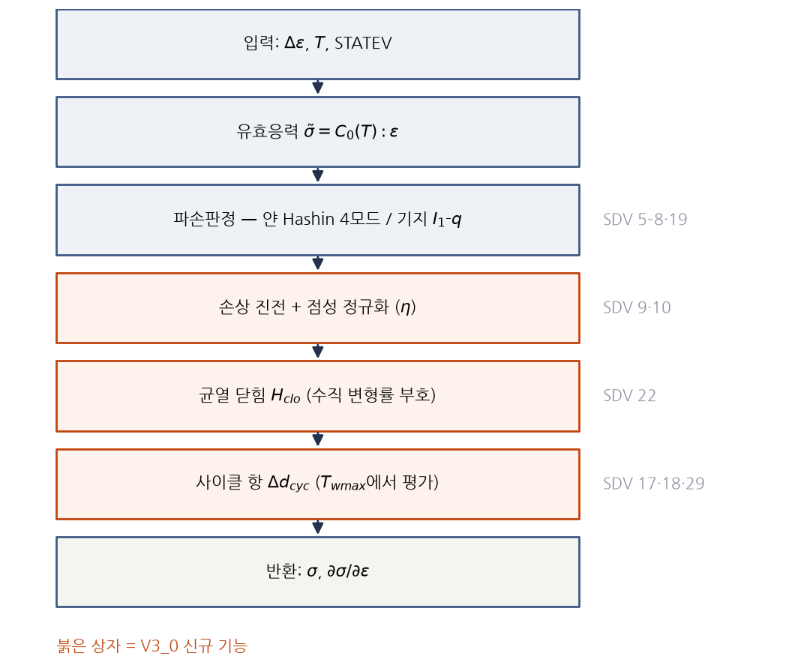
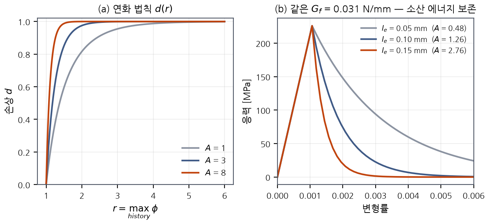
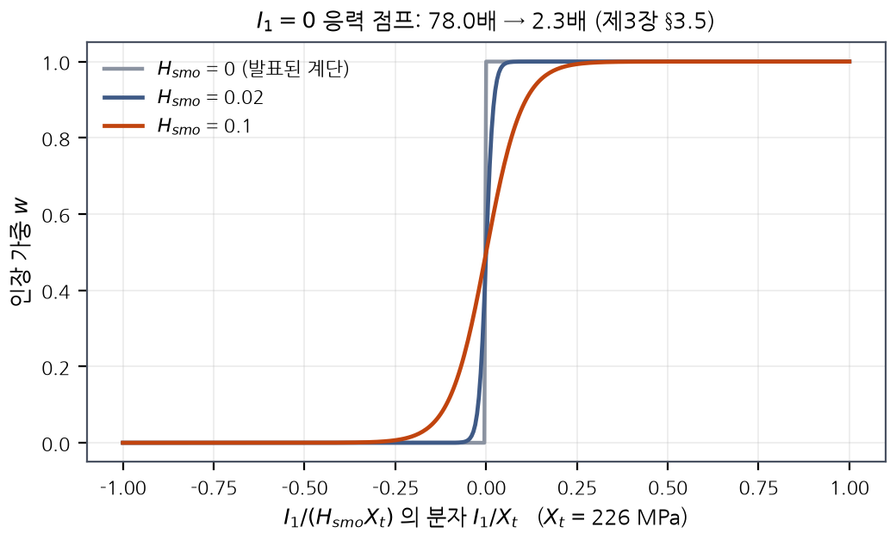
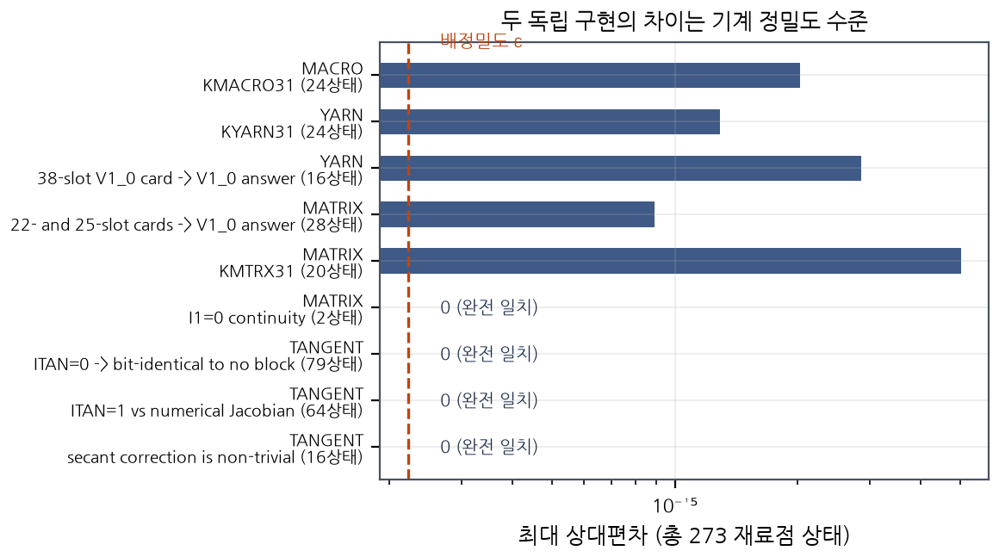

# 제3장 미시 구성모델과 코드 검증

> **문서 성격:** 석사학위논문 제3장 초안 (v1, 2026-07-29 작성).
> 본 장에 인용된 모든 검증 결과는 저장소의 스크립트로 **재현 가능**하며,
> 각 절 끝에 실행 명령을 명시하였다.
> 미결 사항은 §3.8에 모아 두었다.

---

## 3.1 이 장이 답하는 질문

해석 전용 연구에서 심사가 가장 먼저 묻는 것은 **"그 해석을 왜 믿는가"** 이다.
이 질문은 실제로는 서로 다른 세 질문이 겹쳐 있으며, 답하는 방법도 다르다.

| 층 | 질문 | 방법 | 담당 장 |
|---|---|---|---|
| **L1 검증(verification)** | 코드가 **의도한 방정식을 맞게 푸는가** | 단위시험, 해석해 대조, 컴파일된 Fortran 대조 | **제3장** |
| **L2 확인(validation, 미시)** | 그 방정식이 **실제 재료를 맞추는가** | Zhang 등[5] Table 3 재현 | 제4장 |
| **L3 확인(validation, 거시)** | 거시 모델이 **반복 열충격 경향을 맞추는가** | 문헌 실험 데이터 대조 | 제6장 |

**본 장은 L1만을 다룬다.** 이 구분은 형식적인 것이 아니다. L1을 통과하지 못한 코드로
얻은 L2·L3의 일치는 **우연이거나 상쇄된 오차**일 수 있으며, 반대로 L1을 통과한 코드가
L2에서 실패하면 그것은 **코드가 아니라 모델 또는 물성의 문제**임이 확정된다.
즉 L1은 이후 모든 논의에서 **원인을 분리하는 장치**이다.

본 연구에서 이 분리는 실제로 작동하였다. 제4장에서 서술할 RVE 해석의 초기 비수렴은
L1이 통과된 상태에서 발생하였으므로 구성식 구현의 오류가 아님이 즉시 확정되었고,
원인 추적이 **구성식의 수학적 성질**(불연속 스위치)과 **메시 품질**로 곧장 좁혀졌다.

### 검증의 총량

| 스크립트 | 검증 대상 | 항목 수 |
|---|---|---|
| `verify_constitutive.py` | V1_0 구성식 커널 vs 논문 폐형식 | 7 |
| `micromech_check.py` | 얀 물성 vs Chamis/Schapery 마이크로역학 | 12 |
| `verify_thermshock.py` | V3_0 신규 기능 9종 (T1–T9, T9 = 사이클 심각도 창) | 60 |
| `cross_check_fortran.py` | **컴파일된 Fortran** vs 검증된 Python | **273 재료점 상태** |
| `compile_check.sh` | 두 UMAT의 고정형식 Fortran 유효성·인터페이스 | 2 |
| `eval_correlations.py --check` | 물성 상관식 vs 원 논문 자체 서술 + **카드 3종(k, ρ, c_p)이 만드는 열확산율이 SI 값과 일치하는지** | 19 |
| `build_temperature_tables.py --selftest` | 온도 테이블 카드 블록 생성 | 5 |
| `make_macro_thermalshock.py --selftest` | 거시 카드 정적 검증(불량 카드 17종 거부 + $\bar G_f$ 규약 감사 + $A$의 온도 표류 경계 + Quench-측 사이클 카운트 + `*Depvar` 29슬롯 이름이 `homogenize.py`와 일치 + `--hclo` 대조잡 + **`*Orientation` 누락·키워드 접합 감사** + **열카드 단위계·$Bi$·$Fo$ 관문** + **$k(T)$ 형상이 차용이 아니라 유도임을 강제** + **일관접선 블록(ITAN) 부착·미부착 동일성**) | 92 |
| `conductivity_bounds.py --check` | 열전도 경계식·민감도·공극률 모델·동일재료 환산 | 34 |
| `conductivity_temperature.py --check` | $k(T)$ **형상** — Snead 저항선형 형태 회수·CVI 기지의 온도무관 몫·복합재 비율 유도·해석 경로가 RVE_COND를 재현하는지·refs/[20] 차용의 진단과 방향 | 37 |
| `yarn_fracture_energy.py --check` | 얀 횡방향 $G_{tt}$·$G_{tc}$ 출처·균열대 적합성 | 31 |
| `cte_sensitivity.py --check` | 구성재 CTE가 TRS 2.34배 중 차지하는 몫 (평균장 대조는 무손상 RVE 기준, PAN 전용 횡방향 대역 분리) | 69 |
| `cte_r11_envelope.py --check` | refs/[11] 복합재 CTE의 판정 가능성(음성 결과) | 27 |
| `trs_configuration.py --check` | CONFIG_V / CONFIG_P 결정과 두 관문 | 33 |
| `m6_calibration.py --check` | M6 보정 knob 우선순위와 ROM 상한 (M5 T1000 곡선은 2026-08-06부터 저장소에 커밋되어 27이 어디서나 재현된다) | 27 |
| `insitu_yarn_strength.py --check` | 얀 $X_t$의 in-situ 출처·Weibull 구간·온도형상 | 51 |
| `porosity_stiffness.py --check` | 공극률 결정(CVI 하한)·강성 정합·공정 귀속 | 56 |
| `make_property_workbook.py --check` | 물성 현황표가 덱·감사와 어긋나지 않는지 | 22 |
| `msg_residual_census.py --check` | `.msg` 잔차의 상(phase) 분류·드라이버 구분 + **판정 CSV**(값·근거·판정 동행) + **허용치 대조**(잔차가 허용치의 몇 배인가 → TOLERANCE / EQUILIBRIUM) | 29 |
| `damage_ceiling.py --selftest` | 손상 상한 0.9 판정 — 공간 분포(밴드 vs 산포)·하중 이전 포화·Voigt 부풀림 상한, 그리고 **순위표 절단과 결합 손상값에 대한 판정 불가 선언** | 22 |
| `m6_report.py --selftest` | M6 결과 판독기 — 피크 도달 여부, **접선 정의의 정본**(절대 창·원점 통과·$R^2$ 하한)과 기각된 상대 창의 절단 표류 재실측 | 20 |
| `m6_verdict.py --selftest` | M6 판정기 — 접선 함수를 **import 로만** 쓰는지 원본 대조, 세 곡선 재적합, 값·근거·판정 CSV | 19 |
| `compare_tangent.py --selftest` | ITAN 0/1 수렴 비용 대조 — 답이 같은지를 먼저 판정하고, 다르면 비용행을 읽지 못하게 막는다 | 21 |
| `make_rve_conductivity.py --check` | 열전도 덱 — 면집합 재생성·DC3D4·드라이버 제거·**스텝 경계조건 `op=NEW`** + 단위 스탬프·열확산율 | 41 |
| `check_card_ranges.py` | 카드 입력 vs **독립** 문헌 범위 (정본 덱 + **실제로 돌아간 덱**의 이동 슬롯 재판정) | 114 |
| `card_gap_triage.py --check` | GUESS 13개의 knob/도출/공백 분류와 얀 물성 독립대조 | 68 |
| `digitize.py --check` | 문헌 그림 디지타이즈 재현성 | 5 |
| `zhang5_provenance.py --check` | Zhang[5]의 밀도·공극률 진술 유무와 기지 $E$ 정합 | 30 |
| `refs_audit.py --check` | refs/ 전수 — 폐번·고분자기지·인용↔목록·기법 원전·Chamis 식 검증 + 고아 분류 + [S12]·[S13]·C5–C7 미보유 검증 | 134 |
| `gf_temperature.py --check` | $G_f(T)$ 방향(Snead Fig.14)과 $A$ 표류 한계 | 30 |
| `pls_validation.py --check` | 비례한도의 TRS 민감도·정의 취약성·선형구간 비 | 43 |
| `cte_composite_targets.py --check` | refs/[61]의 복합재 CTE 4점과 그 한계 | 32 |
| `cte_rve_verdict.py --check` | RVE 실물 $\bar\alpha$ 대 절대 표적 — 4단 사다리·상별 상하한·남은 세 어긋남 | 38 |
| `modulus_definition.py --check` | 대조 모듈러스 — 한 곡선이 3.13배를 걸친다 | 25 |
| `crack_band_simplex.py --check` | refs/[47]의 2D $\sqrt2$와 a2의 3D $6^{1/3}$ 대조 + refs/[69] published 공식 + 부등부피 일반형 + refs/[46] w_c 대입(범위·거시한정) | 56 |
| `thermal_cycling_dataset.py --check` | 반복 열충격 전 데이터·심각도 역설·임계온도 공백 + [68] 전문 정정·논문 수 | 51 |
| `cycle_jump_provenance.py --check` | cycle jump 기준의 출처 — refs/[57] 손상증분 대 refs/[58] 변화율 + 1 %/3 % 앵커 | 40 |
| `quench_calibration.py --check` | 급랭 h 역산 + Biot 수 | 12 |
| `retune_deck.py --check` | 덱 재튜닝(카드 슬롯·스텝·M6 카드·균열대 허용성·보정가이드 전사 대조·κ 항등식과 거부·ITAN 블록 슬롯과 미지정 시 바이트 동일성·**M7 지렛대 = stabilize, ftol 소진 확인**) | 166 |
| `check_ch1_numbers.py` | 제1장 인용·기여·전방참조 | 53 |
| `check_ch2_numbers.py` | 제2장 본문 수치 vs 문헌 CSV + 사이클 데이터셋 | 46 |
| `check_ch5_numbers.py` | 제5장 vs 덱 생성기 실제값 + **측정 구배 사다리를 `macro_heat_ladder.csv`에서 대조** | 119 |
| `check_ch6_numbers.py` | 제6장 검증표적 vs 사이클 데이터셋 재유도 (T5 정정 + §6.2.3 확정표) | 54 |
| `check_ch4_numbers.py` | 제4장 수치 vs 메시·덱 재유도 (κ×공극 노출·CTE 4단 사다리·$X_{PO}$ 추적 종결·M6 1차 결과 재유도·M6 카드 적법성·접선 정의 확정·T500 허용치 판정·손상 상한 판정 포함) | 174 |
| `check_ch7_numbers.py` | 제7장 결론 경계 — 결과 없는 결론 6개의 근거·결과 의존 구역의 완료어 금지 + 한계 13개(횡방향 압축 「미공개」 판정의 두 다리 포함)와 소성 몫 재유도 | 45 |
| `check_chapter_flow.py` | 제1~5장 유기적 연결성 (본문 `§` 상호참조 전수 해석 포함 — 그림 자리 상자의 참조도 검사 대상) | 216 |
| `review_inbox.py --check` | 리뷰 브랜치(a3) 수신 — 원문 PDF 보유 확인·저자 명단·Zhang의 내부 참고문헌 30·32·33번·Ge Table 3 파괴에너지·두 초안 계보 대조 | 29 |
| `check_manuscript_citations.py` | **제출본 범위** 인용 감사 — 표 등재분의 본문 인용·본문 마커의 표 등재·무인용 동향 주장·[S*] 보유 진술 | 14 |
| `prerun_gate.py --check` | 최소 해석 계획 — §5.7 매트릭스 파싱·단계별 관문/소유자/낭비조건·보정 의존성(자리표 대 미보정 구분)·산출물 부재와 잡 차단의 분리·$G_{tc}$ 메시 적법성 | 44 |
| `pending_slots.py --check` | `[결과 대기]` 슬롯 8개 — 단계·소유자·차단/부분 분류, 부분 채움에 「1차 결과」 표기 강제 | 27 |
| `check_gf_scale_transfer.py` | $\bar G_f$의 소산분 분해·두 규약의 일치·덱 생성기 관문 | 81 |
| `m6_calibration_plan.py` | M6 보정 대상·금지 대상과 그 근거 + 사이클 보정 울타리 4개 + T5 표적 정정 | 33 |
| `plastic_dissipation_audit.py` | Ge 식 (23)(24) 소성 자유에너지가 $A_m$ 에 들어가는가 — **「누락」 지적 철회**와 그 자리에 들어갈 메시 의존 한계 + 균열대 봉 트리거 슬라이스의 의도치 않은 취성 | 15 |
| `knob_sensitivity.py --check` | knob→관측량 정규화 민감도 자코비안(13×10)·SVD 식별성(3강도 행 유효계수 1)·rF의 Ge 식(17) 파생·구조적 영 민감도·CSV/스냅샷 재생성 | 47 |
| `md_to_pdf.py --selftest` | 문서 PDF 변환 — 수식 치환·파일명 규칙 | 11 |
| `md_to_docx.py --selftest` | 논문 초안 워드 합본 — 장 발견·표지 산수(전부 즉석 계산)·수식 막대 정규화 | 10 |
| `make_thesis_figures.py --check` | 논문 그림 15장 — 한글 폰트·문헌값 재유도·덱값 대조·본문 삽입 여부 + **두 물성 계보의 Bi가 같은 냉각시간을 재현하는지·금지 조합 차단** + **그림 3.1의 SDV 번호를 UMAT 헤더에서 되읽어 대조** + **M6 표를 열 이름으로 읽는지·(b)(c)가 m6_verdict 판독기로 원곡선을 읽는지**) | 57 |
| `extract_kbar.py --selftest` | $\bar k$ 공극률 판정 산식 + **Voigt 상한 가능성 검사**·CSV + 상한을 덱 카드에서 읽기·공극률을 파일 전체에서 읽기 + **덱의 단위 스탬프를 읽어 구·신 단위계를 모두 판독** | 33 |
| `sync_check.py --selftest` | 두 에이전트 우편함 — 소유권·형식·반영·영역 | 46 |
| `celent_census.py` | 균열대 폭 `le`=CELENT가 파괴에너지를 얼마나 어긋나게 하는가 (발표 계열 대조 포함) | 35 |
| `extract_pls.py --selftest` | 비례한도(PLS) 추출 — 정의 4종·산포·선형분율 | 30 |
| `extract_probe.py --selftest` | E(N) 프로브 판독 — **Δ기반**(절대반력은 차단 열응력을 읽는다) + `*Depvar` 양쪽 조회 + 스텝 진단 | 13 |
| `compare_cyclejump.py --selftest` | cycle-jump 오차 판정 규칙 + refs/[57]·[58] 역할 분리와 10배 격차 | 11 |
| `damage_map.py --selftest` | 상마다 다른 SDV 번호를 하나의 `DAMG`로 통일 — 크기·모드·국소화 판정·표면/내부 프로파일·CENTROID 대체경로·DCYC 모드(35)·ALL 라벨 basis·**손상 상한을 덱 생성기에서 읽어옴·성분 기준 at-cap 부피분율** | 48 |
| `damage_census.py --check` | 손상 census — 부피가중 분율·ATEFF 클램프 임계·**강도 인용 가부 판정 CSV** | 10 |
| `extract_thermal_profile.py --selftest` | 급랭 HEAT odb 판독 — 열경계층이 요소로 풀렸나 · 첫 프레임이 구배 피크 전인가 · **odb에서 되읽은 열확산율이 카드와 맞나**(1000배 단위오차 탐지) · **저Bi 고유값·욕조온도·alpha(T) 창** | 31 |
| `homogenize.py --selftest` | 거시 카드 조립 — 드라이버→히스토리 영역 해결(집합명 아닌 절점번호)·치환 방지 검사·반력 부호 규약 자기결정 | 18 |
| **합계** | | **3209** |

전부 통과하며, 커밋 전 통과가 프로젝트 규칙으로 강제된다.

### 3.1-a 이 검증 구조는 표준 관행인가 — V&V 위계·문헌 선례 대조 (2026-08-07 점검)

3층 분리는 본 연구의 발명이 아니라 전산고체역학의 표준 위계다. ASME V&V 10[S14]은
검증을 **code verification**(코드가 수학 모델을 정확히 푸는가) · **calculation
verification**(이산화 오차 — 곧 메시 수렴) · **validation**(그 식이 물리를 맞게
그리는가)으로 나누며, Babuška·Oden[S15]이 같은 구분을 학술적으로 정식화했다.
가장 가까운 선행연구도 같은 어휘를 쓴다 — [01a]는 자기 모델의 절차를
"verification and validation"으로 명명하고, 계산 결과를 실험과 겹쳐 "good
agreement demonstrates the validity"로 판정한다.

| 본 논문 | [S14]의 용어 | 하는 일 | 상태 |
|---|---|---|---|
| L1 코드 검증 | code verification | 해석해·단위시험·Fortran↔Python 교차구현(§3.5) | 자동화 완료 — §3.1 장부 |
| 메시 수렴성 | **calculation verification** | 이산화 오차 정량화(제4장 §4.3, `docs/MESH_STRATEGY.md`) | **미완** — κ 활성화·강도 확정의 전제 |
| L2·L3 확인 | validation | 보정과 분리된 문헌 실험 재현(제6장 §6.2.3) | 표적 확정, 실행 대기 |

이 대응표가 드러내는 것을 정직하게 적는다. 표준 위계의 가운데 층인 **calculation
verification이 본 연구의 미완 항목**이며(제7장 §7.3), "메시 수렴성 검증이
κ·강도 확정의 전제조건"이라는 본 연구의 작업 순서는 편의가 아니라 이 위계의
요구와 일치한다.

구성 요소별 선례 — 아래 넷은 보유 원문에서 확인했다:

- **잔존율(%) 재현으로 확인** — 최근접 선행연구 [01a]가 정확히 이 방식이다(위).
  [2]·[3]·[43] 실험 문헌 자신이 잔존율로 보고하므로, 검증 표적의 형식이 곧
  문헌의 보고 형식이다.
- **cycle jump 오차의 실측** — [58]은 "cycle-by-cycle 해가 옳다고 놓고, 점프
  해가 같은 해에 도달하면 점프 기법이 옳다"는 절차를 명시하고 두 해를 직접
  비교한다. 본 연구의 선행검증(CJPRE, 제5장 §5.5.2-a)이 같은 절차다.
- **물성 유도와 검증 대상의 분리** — [57]은 탄성 상수를 피로 시험이 아니라
  마이크로역학으로 별도 유도하고, 모델은 굽힘 피로 이력과의 대조로 평가한다.
  본 연구의 구조(얀 카드는 Chamis/Schapery 유도 · §3.3, 검증은 별도 표적)와
  같은 원칙이다. 보정 앵커([3])와 검증 표적의 그룹 독립성이 부분적이라는
  한계는 제6장 §6.2.3에 있다.
- **균열대 정규화와 요소 크기 관문** — [46]·[47]의 관행을 따르되, 상한을
  문서가 아니라 검사(제4장 §4.3.3)로 강제한다.

관행과의 차이도 적는다. **초과하는 것**: 검증의 전수 자동화(매 커밋 전 §3.1
장부 전량 통과)는 논문 관행이 아니라 소프트웨어 회귀시험 관행의 이식이며, 위
표의 어휘로는 code verification을 상시 재실행 가능하게 만든 것이다. **못
미치는 것**: [S14]가 권하는 불확실성 동반 판정(validation metric)은 본 연구에서
제한적이다 — 1차 표적 문헌 [3]이 산포를 싣지 않아(± 기호 0회), 허용치를 같은
부류 재료의 공표 산포([10], 1.40~4.05 %)에서 빌렸다(제6장 §6.2.3). 이는 문헌
데이터의 한계이며 제7장 §7.3에 기록되어 있다.

---

## 3.2 구성모델의 정식화



**그림 3.1** V3_0 한 증분의 상태 갱신 순서. 붉은 상자가 V3_0의 신규 기능이며, 오른쪽에 각 단계가 쓰는 SDV 번호를 적었다.

### 3.2.1 얀 — 횡등방 탄성-손상

얀은 유효응력 $\tilde{\boldsymbol\sigma} = \mathbf{C}_0 : \boldsymbol\varepsilon$
위에서 3차원 Hashin 기준으로 네 모드를 판정한다($\alpha=\beta=1$).

$$\phi_{1t} = \sqrt{\left(\frac{\tilde\sigma_{11}}{X_t}\right)^2 + \left(\frac{\tilde\sigma_{12}}{S_{12}}\right)^2 + \left(\frac{\tilde\sigma_{13}}{S_{13}}\right)^2}, \qquad \tilde\sigma_{11}\ge 0$$

$$\phi_{1c} = \frac{|\tilde\sigma_{11}|}{X_c}, \qquad \tilde\sigma_{11} < 0$$

$$\phi_{tt} = \sqrt{\left(\frac{\tilde\sigma_{22}+\tilde\sigma_{33}}{Y_t}\right)^2 + \frac{\tilde\sigma_{23}^2 - \tilde\sigma_{22}\tilde\sigma_{33}}{S_{23}^2} + \left(\frac{\tilde\sigma_{12}}{S_{12}}\right)^2 + \left(\frac{\tilde\sigma_{13}}{S_{13}}\right)^2}$$

횡방향 압축($\tilde\sigma_{22}+\tilde\sigma_{33} < 0$)에는 대응하는 Hashin 형식을 쓴다.
모드별 손상은 지수 연화로 진전하고, 종방향/횡방향으로 곱셈 결합한 뒤 전단 성분에
연계된다.

$$d_1 = 1-(1-d_{1t})(1-d_{1c}), \quad d_t = 1-(1-d_{tt})(1-d_{tc})$$
$$d_{12} = 1-(1-d_1)(1-d_t), \quad d_{23} = 1-(1-d_t)^2, \quad d_{31} = 1-(1-d_t)(1-d_1)$$

**손상된 강성은 컴플라이언스 기반으로 구성한다.** 즉 $E_i(1-d_i)$로 대각항을 낮추되
$\nu_{ij}$를 $(1-d_i)$로 함께 축소하여 비대각 컴플라이언스 $-\nu_{ij}/E_i$가 보존되도록
한다. 이는 손상이 포아송 결합을 인위적으로 바꾸지 않게 하기 위함이다.

종방향 인장에는 선형-지수 혼합법칙(섬유 인발을 표현)을 선택적으로 쓸 수 있다.

### 3.2.2 기지 — 등방 탄소성-손상

기지는 유효응력 공간에서 von Mises 소성(연계유동, 선형 등방경화)을 **정확한 1단계
반경복귀**로 적분한 뒤 손상을 평가한다.

$$\Delta\lambda = \frac{q^{tr} - \sigma_y}{3G + H}, \qquad \sigma_y = \sigma_{y0} + H\bar p$$

손상 개시는 유효응력의 von Mises 값을, **제1불변량 $I_1$의 부호로 고른 강도**로 나눈다.

$$\phi = \begin{cases} q/X_t & I_1 \ge 0 \\ q/X_c & I_1 < 0 \end{cases}$$

> **§3.4.3에서 다시 다룰 것:** 이 부호 스위치는 물리적으로는 단방향(unilateral)
> 거동을 뜻하지만, **수치적으로는 불연속**이며 본 연구에서 실제 문제를 일으켰다.

### 3.2.3 손상 진전과 균열대 정규화



**그림 3.2** (a) 지수 연화 법칙 $d(r)$ — $A$가 클수록 급격히 연화한다. (b) 같은 파괴에너지 $G_f$에서 요소 크기 $l_e$가 달라지면 $A$가 달라져, 소산 에너지가 보존된다. 세 요소 크기는 모두 스냅백 한계 아래에 있다.

$$d = 1 - \frac{\exp[A(1-r)]}{r}, \qquad r = \max_{\text{history}}\phi$$

$A$는 고정 상수로 두거나, 파괴에너지 $G_f$와 요소 특성길이 $l_e$로부터 결정한다.

$$A = \frac{2 g_0 l_e}{G_f - g_0 l_e}, \qquad g_0 = \frac{X^2}{2E}$$

$G_f \le 1.02\,g_0 l_e$ 인 요소는 스냅백 영역이므로 $A$를 50으로 고정하고, 전체를
$[0.01,\,50]$으로 클램프한다. **이 클램프가 발동하는 요소가 존재하면 그 요소는 사실상
취성 파괴하므로, 클램프 발동 여부를 상태변수(`ATEFF`)로 출력하여 사후 확인한다.**

### 3.2.4 점성 정규화와 선제 컷백

연화 구간의 수치 안정화를 위해 손상 목표값에 1차 점성 완화를 적용한다.

$$d^{n+1} = d^n + \gamma\,(d_{\text{target}} - d^n), \qquad \gamma = \frac{\Delta t}{\eta + \Delta t}$$

$\eta \to 0$이면 무정규화 해로 환원된다. 또한 한 증분에서 손상 도약이 허용치를 넘으면
UMAT이 `PNEWDT`로 **증분을 선제적으로 줄이도록** 요청한다. 이는 솔버가 비수렴을
겪은 뒤 사후에 줄이는 것과 달리, 큰 도약이 **커밋되기 전에** 개입한다.

**실행:** `python3 verification/verify_constitutive.py`

---

## 3.3 물성 검증 — 얀 카드는 유도된 값인가

기지 물성은 Zhang 등[5] Table 2에서 온다. **다만 그 표는 측정값이 아니다** — 캡션이
*"Material properties of the matrix **[35–37]**"* 이므로 [5]가 다른 논문 셋에서
**빌려온 값**이며, [5]가 시험한 PIP 시편의 기지를 잰 것이 아니다(그 셋 중 세 번째가 우리
`refs/[63]`이다). 이 사실이 왜 중요한지는 제4장 §4.9-13에 있다 — 350 GPa는 공극률
7.7 %를 함의하는데 측정 밀도는 19.6 %를 요구하며, 그 **4.3배** 차이가 논문의
한계로 기록되어 있다. 판정기: `python3 data/literature/zhang5_provenance.py --check`.

> **★ 그러나 빌려온 값이 곧 틀린 값은 아니다 — 독립 출처가 같은 셋을 준다.**
> Camus 등[59]은 2D 평직 C/SiC의 손상 발달을 다루면서 SiC 기지의 물성으로
> $E$ = **350 GPa**, $\nu$ = **0.2**, $\alpha$ = **4.6×10⁻⁶/°C**를 쓴다.
> 본 연구 카드는 350 / 0.20 / 4.5×10⁻⁶이므로 $E$와 $\nu$는 **동일**하고 CTE는
> **2.3 % 이내**다. 1996년의 독립 논문이 같은 값에 도달한다는 것은, 이 셋이
> Zhang[5]이 임의로 고른 값이 아니라 **SiC 고체상의 표준값**임을 뜻한다.
>
> **이것이 무엇을 지우고 무엇을 남기는가.** 지워지는 것은 "카드값이 이상치"라는
> 의심이다(본 연구도 한때 그렇게 판단했다가 이 근거로 철회하였다). 남는 것은
> §4.9-13의 공극률 불일치이다 — 350 GPa는 **고체상 값**이고 우리 RVE에는 공극
> 기하가 없으므로, 문제는 값의 출처가 아니라 **공극을 어디서 반영하는가**이다.
> 두 학파(고체상 350 대 공극 반영 유효값 80–143)가 병존하며, 본 연구는 Zhang[5]
> 재현을 검증 사슬로 쓰기 위해 고체상 값을 유지한다. 그 대가가 §4.9-13이다.
> 판정기: `python3 data/literature/refs_audit.py --check`

얀 물성 12개는 논문이 **T300 필라멘트
(Table 1)와 SiC(Table 2)로부터 Chamis 강성식[S6]과 Schapery CTE식[S7]으로 계산했다**고만
서술하고 값을 주지 않는다. 따라서 카드의 12개 상수가 정말 그 마이크로역학에서
유도되는지를 **독립적으로 재계산하여 확인**하였다.

> **인용 형태에 관한 주의.** Chamis의 단순화 마이크로역학식은 통상 *SAMPE Quarterly*
> **15**(3) (1984) 14–23으로 인용되나, **이 저널은 DOI가 없고 원문 확보가 어렵다** —
> 심사위원이 식을 확인할 수 없는 형태이다. 동일 내용이 **NASA TM-83320** (1983)으로
> 먼저 공개되었고 **NASA NTRS(ID 19830011546)에서 무료로 전문을 볼 수 있으므로**,
> 본 논문은 **NASA TM을 주 인용[S6]으로 하고 SAMPE를 병기**한다. 검증 스크립트가
> 재현하는 식들은 그 TM의 것이다.

얀 수준 섬유체적비를 카드의 $E_1$에서 역산하면 $V_f = 0.79194$ 이며, 이는 복합재
체적비 39.6 %에 해당하여 논문의 "약 40 %"와 일치한다. **이 하나의 $V_f$로 나머지
11개 상수가 모두 재현된다.**

| 상수 | 마이크로역학 | 카드값 | 상대오차 |
|---|---|---|---|
| $E_1$ | 254 967.23 | 254 967.228042 | 0.000 % |
| $E_2 = E_3$ | 44 321.74 | 44 321.737572 | 0.000 % |
| $\nu_{12}=\nu_{13}$ | 0.247516 | 0.247517846 | 0.000 % |
| $\nu_{23}$ | 0.395833 | 0.395813581 | 0.005 % |
| $G_{12}=G_{13}$ | 26 430.91 | 26 431.515264 | 0.002 % |
| $G_{23}$ | 15 876.45 | 15 876.667974 | 0.001 % |
| $\alpha_1$ | 1.0706×10⁻⁶ | 1.070926×10⁻⁶ | 0.000 % |
| $\alpha_2=\alpha_3$ | 3.3296×10⁻⁶ | 3.324909×10⁻⁶ | 0.142 % |

**12개 상수 전체의 최대 상대오차 0.142 %.** 얀 카드는 논문의 구성재 데이터를 충실히
균질화한 결과임이 확인된다.

> 이 검증이 필요한 이유는 단순하다. 카드에 적힌 8자리 숫자가 어디서 왔는지 모르면,
> 나중에 물성을 바꿔야 할 때 **어느 숫자를 어떻게 바꿔야 하는지 알 수 없다.**
> 유도 경로가 확인되었으므로, 제4장 이후의 온도의존 물성은 이 경로를 그대로 따라
> $V_f$를 고정한 채 구성재 물성만 온도의존으로 바꾸어 생성한다.

**실행:** `python3 verification/micromech_check.py`

---

## 3.4 V3_0의 신규 기능과 그 검증

V1_0은 Zhang 등[5]의 재현 전용이며 **동결**되어 있다. 본 연구가 추가한 기능은 모두
V3_0 계보에 들어가며, V3_0은 V1_0의 **엄격한 상위집합**이어야 한다 — 즉 V1_0 카드를
그대로 주면 V1_0과 **비트 단위로 동일한 답**을 내야 한다. 이는 회귀시험 T2가 강제한다.

### 3.4.1 온도의존 물성 (T1, T3)

절대값이 아니라 **배율 테이블** $f(T)$를 카드에 덧붙인다. 이렇게 하면 검증된 V1_0의
기준 상수가 카드에 그대로 보이고, $f \equiv 1$이 V1_0을 정확히 복원한다.
구간 밖은 **외삽하지 않고 최근접 값으로 고정**한다.

| 검증 항목 | 결과 |
|---|---|
| 테이블 절점에서 정확히 그 값 | PASS |
| 절점 사이 선형성 | PASS |
| 구간 밖 클램핑(외삽 없음) | PASS |
| 배율 적용 결과 == 손으로 축소한 카드 | PASS |

> **CTE는 이 테이블에 넣지 않는다.** Abaqus `*EXPANSION`이 무응력 온도 기준 할선
> CTE를 이미 지원하며, 그것이 TRS 계산에 필요한 적분
> $\varepsilon_{th} = \alpha(T)(T-T_0) - \alpha(T_i)(T_i-T_0)$ 을 정확히 수행한다.
> UMAT은 계속 **역학 변형률만** 받는다. 이 분리를 지키지 않으면 열변형률이 이중
> 계산된다.

### 3.4.2 단방향 손상 — 균열 닫힘 (T4)

$$d_{\text{eff}} = \begin{cases} d & \varepsilon_n \ge 0 \\ d(1-H_{clo}) & \varepsilon_n < 0 \end{cases}$$

$H_{clo}=0$이 V1_0, $H_{clo}=1$이 완전 회복이다. **전단 손상은 회복시키지 않으며,
저장된 손상 이력 $d$는 건드리지 않는다** — 닫힘은 시컨트 강성만 바꾸고 손상의 단조성은
보존된다. 검증 5항목 전부 PASS.

> **한계 — 이 구현은 문헌의 최선보다 단순하다.** Li 등[60](Part II)은 같은 재료
> (2D 평직 C/SiC)에 대해 손상 비활성화를 **연속함수**로 두고, 나아가 **이축 압축에서
> 단축 압축보다 비활성화가 빠르다**는 것을 정식화한다. 본 연구의 $H_{clo}$는
> **상수 계수 하나**이므로 단축과 이축을 구분하지 않는다.
>
> 이 단순화를 받아들이는 근거는 두 가지이다. (i) 본 연구의 기여는 균열 닫힘 정식화
> 자체가 아니라 **그것이 반복 열충격에서 사이클 수에 대해 어떻게 누적되는가**이며,
> [60]은 **단조 하중만** 다룬다. (ii) $H_{clo}$를 민감도 파라미터로 훑으면 이축
> 가속의 효과가 만드는 구간을 **포락**할 수 있다. 다만 이는 포락이지 재현이 아니며,
> **제6장의 급가열 반사이클 해석에서 $H_{clo}$ 민감도를 반드시 함께 보고한다.**
> 자세한 위치 설정은 제2장 §2.8.1-a.
>
> **정식화 자체의 원전은 Chaboche 등[54]이다** (2026-08-06 OCR 전문 판독).
> ① 닫힘 시 **부호가 바뀐 수직 변형률의 대각 강성항만** 수정해야 응력–변형률
> 연속성이 보장된다(그들의 식 16) — 본 구현이 전단 손상을 회복시키지 않는 선택과
> 같은 원리다. ② 그들의 닫힘 가중계수 $\eta$는 **[0,1] 전 범위**로 출판되어 있어
> $H_{clo} \in [0,1]$ 슬롯 설계의 직접 근거가 된다. ③ 단 [54]는 닫힘점을 0이 아니라
> **C/SiC에서 관측되는 잔류변형률**에 묶는다 — 본 구현은 $\varepsilon_n = 0$에서
> 닫으므로, 잔류변형률이 자라는 사이클 후반에는 닫힘 시점이 이르게 평가될 수 있다.
> 이것도 위 포락 논리로 흡수되는 한계로 기록한다.

### 3.4.3 $\mathrm{sign}(I_1)$ 스위치의 정규화 — 본 연구에서 실제로 문제가 된 지점



**그림 3.3** $\mathrm{sign}(I_1)$ 스위치의 tanh 정규화. $H_{smo}=0$은 발표된 계단이고, $H_{smo}$를 키우면 전이가 매끄러워진다. $I_1=0$을 지나는 응력 점프는 78.0배에서 2.3배로 줄어든다(§3.5).

§3.2.2의 부호 스위치는 물리적으로 타당하나, **수치적으로는 응력의 불연속**이다.
인장에서 손상된 적분점은 $d_t > 0$이고 $d_c = 0$이므로, $I_1$이 0을 지나는 순간
시컨트 강성이 $1/(1-d_t)$ 배로 도약한다. $d_t = 0.9$에서 **10배**이다.

> **이것은 본 연구의 구현 결함이 아니라 손상역학이 이름 붙여 놓은 난제다.**
> Chaboche[S10]는 단방향(active/passive) 조건을 다루는 네 계열의 이론 — 스칼라·
> 벡터·2계·4계 손상변수 — 을 비교하여, *"the selected candidate theories either
> show a **discontinuous stress–strain response** when the unilateral condition
> takes place or an unacceptable nonsymmetric elastic behaviour"* 임을 보이고
> 이를 *"fundamental problem"* 이라 부른다. 즉 유도 이방성과 단방향 효과를
> **동시에** 만족시키는 이론은 없으며, 어느 쪽을 택하든 대가가 있다. 본 연구가
> 만난 78.0배 계단은 그 대가의 한 사례이고, 아래 tanh 정규화는 그 난제를
> **푸는 것이 아니라 폭을 선언하고 보고 가능하게 만드는** 공학적 처리다.

이는 변형률이 변하지 않는데 응력이 변하는 것이므로 **Newton 반복이 원리적으로 수렴할
수 없다.** 실제 RVE 해석에서 이 현상은 다음과 같이 관측되었다.

```
반복 12   잔차  5.104E-03   변위보정 +1.709E-09
반복 13   잔차 -3.833E-02   변위보정 -1.709E-09
```

변위보정의 **크기가 같고 부호만 반대**인 완전한 2-주기 진동이며, 변위 증분이
$10^{-9}$ mm(수치적으로 0)인데 잔차가 7.5배 변하였다. 시간증분을 줄이는 것으로는
해결되지 않는다 — 도약이 증분 크기의 함수가 아니기 때문이다.

**해결:** 반폭 $H_{smo}\!\cdot\!X_t$의 tanh 혼합으로 대체한다.

$$w = \tfrac12\big[1+\tanh\!\big(I_1/(H_{smo}X_t)\big)\big], \qquad d_{\text{act}} = w\,d_t + (1-w)\,d_c$$

**컴파일된 Fortran에서 직접 측정한 결과:**

| $H_{smo}$ | $I_1=0$ 통과 시 최대 응력 계단 |
|---|---|
| **0 (논문 원식)** | 평균 계단의 **78.0배** |
| 0.1 | **2.3배** (연속) |

$H_{smo}=0$이 원식과 비트 단위로 일치함을 28개 상태에서 확인하였으므로(§3.5),
이는 **모델의 변경이 아니라 폭이 보고 가능한 정규화**이다. 논문에는 $H_{smo}$ 값과
그 값에 대한 결과의 둔감성을 함께 제시해야 한다.

**솔버 상에서의 확인 (M3, 2026-07-30).** 위 진단은 단위시험이 아니라 실제 RVE
해석으로도 검증되었다. $H_{smo}=0.1$을 적용한 M3 해석에서, 이전에 완주하지 못했던
**재가열 스텝이 두 잡 모두 무결하게 통과**하였다.

| 재가열 스텝 (23 → $T$ °C) | 증분 수 | 실패 시도 | 증분 크기 중앙값 |
|---|---|---|---|
| $H_{smo}=0$ (M1FIX, T500) | 12 888 시도 | **2 888** | 9.5e-08 (허용 최대의 1/26 000) |
| $H_{smo}=0.1$ (M3, T500) | **404** | **0** | **2.5e-03 (허용 최대)** |
| $H_{smo}=0.1$ (M3, T1000) | **403** | **0** | **2.5e-03 (허용 최대)** |

증분당 평형반복은 2.3–2.6회로, 손상이 진행되지 않는 선형 문제와 사실상 같다.
재가열 스텝은 기지 전체가 온도 상승에 따라 차례로 $I_1=0$을 통과하므로 이 불연속에
가장 민감한 구간이며, 그 구간이 정확히 해소되었다는 점에서 **인과가 특정된다.**
이는 T3 기능에 대한 단위시험을 넘어선 시스템 수준 증거이다.

### 3.4.4 사이클 손상과 shakedown 실증 (T5, T6)

**T5는 본 연구에서 가장 중요한 단위시험이다.** 단조 CDM만 켠 상태로 동일 진폭
열싸이클을 반복하면, 손상 구동변수가 이력 최대값이므로 2번째 사이클부터 손상이 자라지
않는다. 이를 수치로 확인하였다.

> 단조 CDM만 활성일 때 $N = 2 \to 60$ 사이의 손상 증가분 = **정확히 0**

이는 결함이 아니라 **구성모델이 원리적으로 무엇을 못 하는지를 보인 것**이며, 사이클
손상항 도입의 근거가 된다. 사이클 손상을 켜면 손상이 정상적으로 누적된다.

**T6은 cycle jump의 정확도를 검증한다.** 한 증분이 $\Delta N$ 사이클을 대표하도록
외삽했을 때, 명시적으로 모두 푼 결과와의 오차가 허용범위 안임을 확인한다.

### 3.4.5 파손기준 (T7, T8)

세 기준(Hashin / Tsai–Wu / D-criterion)을 동시에 평가하되 **손상은 Hashin만이
구동**한다. 검증에서 확인한 두 가지:

1. **Tsai–Wu의 하중 배수 정규화 (T7, 13항목).** 강도비 $R$을 $aR^2+bR=1$에서 풀고
   $FI = 1/R$을 쓰면 Hashin 지수와 동일하게 응력에 대해 1차 동차가 된다.
   **시험: 하중을 2배로 하면 지수가 정확히 2배가 되어야 한다** — PASS.
   원형 다항식을 그대로 쓰면 이 시험을 통과하지 못하며, 두 지수를 나란히 놓는
   비교 자체가 무의미해진다.
2. **완전 수동성 (T8, 14항목).** 기준을 켜고 끄는 것이 응력·강성을 바꾸지 않는다.
   $\max|\Delta\sigma| = 0.000$. **즉 비교의 계산 비용이 실제로 0이다.**
   또한 면외 손상이 0일 때 3차원 확장이 원 논문의 평면응력 식으로 정확히 환원됨을
   확인하였다.

**실행:** `python3 verification/verify_thermshock.py`

---

### 3.4.6 정합접선(consistent tangent) — Ge 식 (31)–(33)

**무엇이 문제였나.** V1_0 계보는 `DDSDDE`에 **시컨트** 연산자 $\mathbf{C}(d)$를
그대로 넣었다. 그러나 Ge는 실제로 수행되는 응력 갱신과 **정합인** 접선을 유도하고,
그 이유를 *"to ensure the quadratic convergence rate of the Newton-Raphson method"*
(p.92)라고 명시한다. 즉 시컨트를 쓰면 연화 구간에서 Newton의 수렴률이
**2차에서 1차로 떨어진다.** 본 연구의 M1 3차에서 점성계수 $\eta$를
$0.02 \to 0.05$로 올려야 했던 것은 이 구조적 결손을 **점성으로 대신 사는** 행위였다.
Ge 자신은 $\eta$가 *"small compared to the characteristic time increment"*여야 한다고
쓰는데, 우리 $\Delta t \approx 10^{-3}\text{–}2.5\times10^{-3}$에서 $\eta=0.05$는
이미 권고의 **20–50배**다(`verification/CALIBRATION_GUIDE.md` §4).

**무엇을 넣었나.** Ge 식 (31)

$$\mathbf{C}_t = \mathbf{S}^{-1}(d^v):\left[\mathbf{I}-\mathbf{M}(d^v)\right],\qquad
\mathbf{M}=\sum_I \frac{\partial \mathbf{S}}{\partial d_I}\!:\!\boldsymbol\sigma\;
\frac{\Delta t}{\eta+\Delta t}\;\frac{\partial d_I}{\partial \boldsymbol\varepsilon}$$

에서 시컨트가 버리는 항, 즉 **손상의 변형률 미분** $\partial d/\partial\varepsilon$을
파손지수 $r$을 거쳐 연쇄법칙으로 전개하였다. 구체적으로

1. 파손지수의 기울기 $\partial\phi/\partial\varepsilon$ — 유효응력이 $\tilde\sigma
   =\mathbf{C}_0\!:\!\varepsilon$으로 **손상과 무관**하므로(Ge 식 4) 닫힌 형태로 나온다,
2. Kuhn–Tucker 이력 $r=\max(r_n,\phi)$의 하중/비하중 분기(Ge 식 14–15),
3. **균열대 정규화된 지수형 법칙**의 $\mathrm{d}d/\mathrm{d}r
   = e^{A(1-r)}(Ar+1)/r^2$ (Ge 식 16·18, $A$는 식 19–21로 결정),
4. 1t 모드의 **혼합 선형–지수 법칙**(Ge 식 16 2행 + 식 17)의 미분 —
   보조변수 $d^L$, $r^F$의 두 분기와 그 고정 구간을 각각 처리,
5. 전단 커플링(Ge 식 3)·균열닫힘·사이클손상까지의 연쇄,
6. $S_{Y0}>0$일 때 **소성 정합항** — Ge 식 (32)의
   $\partial\tilde\sigma/\partial\varepsilon$과 식 (33)의 등가강성 $\bar{\mathbf{C}}$.

**축약된 곳은 명시한다.** 우리 기지 소성은 von Mises + **선형** 등방경화의
정확한 1-step 반경귀환이므로(refs/GE2018_EXTRACTION.md §D, Ge 식 25–28 행),
Ge의 음함수 쌍 (32)+(33)은 고전적 폐형식
$\mathbf{C}^{ep}=\mathbf{C}_0-\beta\,\partial \mathbf{s}^{tr}/\partial\varepsilon
-\mathbf{s}^{tr}\otimes\partial\beta/\partial\varepsilon$,
$\beta=3\mu\Delta\lambda/q^{tr}$로 **붕괴한다.** 식 (33)의
$\bar{\mathbf{C}}$는 버려진 것이 아니라 이 첫 항($2\mu\to2\mu(1-\beta)$)에 들어 있다.
Ge 식 (8)이 허용하는 **일반 비선형 경화곡선**을 넣는 순간 이 폐형식은 무효가 되며,
그때는 식 (27)을 직접 미분해야 한다 — 이는 구현하지 않았다.

**검증 — 수치 Jacobian이 유일한 합격 기준.** 틀린 Jacobian은 시컨트보다 **나쁘다**.
수렴이 조용히 느려지거나 엉뚱한 곳으로 갈 뿐 에러를 내지 않기 때문이다. 따라서
해석 접선을 **UMAT이 실제로 수행하는 응력 갱신의 중심차분 미분**과 대조하였다
(변형률 성분마다 $\pm10^{-9}$, 매번 동일한 증분 시작상태에서 재호출).

| 영역 | 상태 수 | $\max|\mathbf{C}_t-\mathbf{C}_{fd}|/\max|\mathbf{C}_t|$ |
|---|---|---|
| 탄성 | 12 | 2.5×10⁻¹¹ |
| 손상 개시 | 12 | 7.5×10⁻¹⁰ |
| 연화 | 16 | 6.1×10⁻⁹ |
| 동결(비하중, $\mathrm{d}r=0$) | 6 | 2.3×10⁻¹⁰ |
| 소성(손상 없음) | 4 | 1.3×10⁻¹⁰ |
| 소성+손상 | 4 | 1.1×10⁻⁹ |
| 소성+$H_{smo}$ | 4 | 1.1×10⁻⁹ |
| $I_1$ 혼합구간(§3.4.3) | 3 | 3.8×10⁻¹⁰ |
| 사이클손상 | 3 | 6.9×10⁻⁹ |

전 영역에서 $10^{-8}$ 이하이며, 이는 중심차분 자체의 정밀도 한계 수준이다.
동시에 **연화 상태에서 보정항은 시컨트의 206 %에 달한다** — 즉 빠져 있던 항은
연산자와 같은 크기였다.

**기본값은 OFF다.** 카드 맨 끝에 2슬롯 블록 `ITAN`(0/1) + 키 `33.0`을 붙여야만
켜지며, 붙이지 않거나 `ITAN=0`이면 응력·상태변수·`DDSDDE`가 블록 없는 카드와
**비트 단위로 동일**하다(79개 상태에서 확인). V1_0은 동결이므로 손대지 않았고,
현재 저장소의 모든 덱은 블록을 갖지 않으므로 **기존 결과는 하나도 바뀌지 않는다.**
켜는 것이 실제로 $\eta$를 0.05에서 되돌릴 수 있는지는 **실메시 수렴 연구**가
답할 문제이며, 그 연구를 하기 전까지 스위치는 꺼 둔다.

**실행:** `python3 verification/cross_check_fortran.py`
(`TANGENT` 3개 시험군)

---

## 3.5 Fortran–Python 교차검증 — 이 장에서 가장 중요한 절



**그림 3.4** Fortran↔Python 교차검증. 아홉 시험군 273개 재료점 상태의 최대 상대편차이며, 모두 배정밀도 정밀도 수준이다(정합접선 3개 군은 0, 즉 완전 일치). 막대는 `verification/cross_check_fortran.py`의 실제 실행 출력에서 읽는다.

**Python 단위시험이 통과했다는 것은 *모델*이 맞다는 뜻이지 *Fortran*이 맞다는 뜻이
아니다.** 둘은 별개의 코드이며, 카드 슬롯이 하나 뒤바뀌거나 부호 오타가 하나 있으면
Python 시험을 전부 통과하고도 Abaqus에서 틀린 답이 나온다. 그런 오류는 결과가
"그럴듯하기" 때문에 사후에 발견하기가 매우 어렵다.

따라서 UMAT의 실제 서브루틴(`KMACRO31`, `KYARN31`, `KMTRX31`)을 **gfortran으로
컴파일하여 독립 드라이버로 직접 호출**하고, 검증된 Python 모델과 다음 세 가지를
무작위 상태에 대해 대조하였다.

- 응력 6성분
- 손상된 시컨트 강성의 대각 6성분
- **모든 상태변수(STATEV)**

| 대조 케이스 | 상태 수 | 최대 상대편차 |
|---|---|---|
| MACRO (온도 테이블 + 균열닫힘 + 사이클손상 + $T_{max}$ 창) | 24/24 | 2.03×10⁻¹⁵ |
| YARN (온도 테이블 + 균열닫힘) | 24/24 | 1.29×10⁻¹⁵ |
| YARN — 38슬롯 V1_0 카드 → V1_0 답 | 16/16 | 2.86×10⁻¹⁵ |
| MATRIX — 22슬롯·25슬롯 카드 → V1_0 답 | 28/28 | 0.89×10⁻¹⁵ |
| MATRIX — $H_{smo}>0$ 혼합 | 20/20 | 5.02×10⁻¹⁵ |
| MATRIX — $I_1=0$ 연속성 (§3.4.3) | 2/2 | — |
| TANGENT — `ITAN=0`이 블록 없는 카드와 비트 동일 (§3.4.6) | 79/79 | 0 (완전 일치) |
| TANGENT — `ITAN=1` 해석 접선 vs 수치 Jacobian (§3.4.6) | 64/64 | 0 (별도 지표, 아래) |
| TANGENT — 시컨트 대비 보정이 자명하지 않음 (§3.4.6) | 16/16 | — |
| **합계** | **273/273** | **≤ 5.1×10⁻¹⁵** |

편차가 배정밀도 기계오차 수준이므로 **두 구현은 같은 계산을 하고 있다.**

> **이 교차검증은 원래 계획에 없었으나 실제로 오류를 잡았다.** Python 미러의 상태변수
> 누락이 이 시험에서 발견되었다. 계획에 없던 검증이 오류를 잡았다는 사실 자체가
> 이 층의 필요성을 보여준다.

**실행:** `python3 verification/cross_check_fortran.py` (gfortran 필요)

---

## 3.6 입력덱의 정적 검증 — 솔버를 돌리기 전에 잡는 것

UMAT은 카드 슬롯을 위치로 읽으므로, **슬롯이 하나 밀리면 강도 자리에 계수가 들어가고도
해석이 조용히 수렴한다.** 이런 오류는 해석 시간을 전부 쓴 뒤에야 이상한 결과로
드러나므로, 솔버 없이 가능한 검증을 **전부** 마친 뒤에 실행하는 것을 규칙으로 삼았다.

| 검증기 | 무엇을 막는가 |
|---|---|
| `make_macro_thermalshock.py --selftest` | 거시 카드의 슬롯 수·가드 상수·`*Depvar` 개수. **불량 카드 15종을 실제로 거부하는지**까지 확인. 여기에는 UMAT이 **거부하지 않는** $\bar G_f$ 규약 오류(§4.9-16)도 포함된다 |
| `retune_deck.py --check` | 재튜닝 시 메시·주기경계조건 보존, 의도한 4개 슬롯만 변경, `constants=` 개수 갱신 |
| `build_temperature_tables.py --selftest` | 온도 테이블 블록의 행 수·단조성 |

각 UMAT 카드에는 **가드 상수**를 마지막 슬롯에 두었다(기지 30.0, 거시 31.0, 평활화
블록 32.0). 카드 계보가 섞이면 UMAT이 조용히 오독하는 대신 **즉시 중단**한다.
평활화 블록을 추가할 때는 카드 길이 22, $23+4N_T$, $25+4N_T$ 가 4로 나눈 나머지가
각각 2, 3, 1이 되도록 설계하여 **길이만으로 계보가 판별**되게 하였다.

> **실제로 잡힌 오류.** 재튜닝 도구가 슬롯을 추가하면서 키워드 줄의 `constants=22`를
> 갱신하지 않는 버그가 자체시험에서 발견되었다. 그대로 두었으면 Abaqus가 25개 상수를
> 22개로 읽고 **거부하지 않은 채 잘못 해석**했을 것이다.

---

## 3.7 물성 상관식과 문헌 데이터의 검증

물성 숫자를 CSV에 손으로 적는 대신 **원 논문의 상관식을 코드로 구현하고, 논문이 스스로
적은 값과 대조**하는 방식을 취하였다. 전사 오류가 실제로 두 번 발생했기 때문이다.

- **Snead 등[06] Eq.16의 마이너스 부호 누락.** 자동 텍스트 추출이 상수항의 부호를
  삼켰다. 그대로 쓰면 298 K에서 CTE가 참값의 2.6배가 되고 **TRS 전체가 틀어진다.**
  페이지 이미지를 렌더링하여 확인·수정하였다.
- **Pradère & Sauder[07] Table 3/4의 단위 오해.** 이 표는 CTE가 아니라 **누적 열변형률**
  이다. CTE율로 읽으면 값이 여섯 자리 틀린다. 오히려 이 형태가 유리한데, Abaqus가
  요구하는 것이 열변형률이므로 정확한 할선 CTE를 바로 계산할 수 있다.

문헌 그림에서 읽은 값도 마찬가지로 **재현 가능한 디지타이즈**로 만들었다
(`digitize.py`). 축 눈금 격자를 최소제곱으로 보정하고, 곡선은 열 평균이 아니라
원점에서부터 좌우로 **추적**하며, 마커는 연결성분으로 검출한다. 각 그림마다
**논문 본문이 스스로 말하는 값과 대조하는 검산**이 붙어 있다.

> 곡선 추적을 쓰는 이유는 실제로 겪은 실패 때문이다. 열 방향 평균을 쓰면 축선·눈금·
> 범례·화살표가 함께 평균되어 피크가 258 MPa 대신 199.9 MPa로 나온다.

---

## 3.8 본 장의 한계와 미결 사항

**검증되지 않은 것을 명시하는 것이 검증 장의 일부이다.**

1. **메시 수렴성 검증이 아직 없다.** 현 단계는 탐색용 거친 RVE 메시(26 452 C3D4)를
   쓴다. 체적평균량($\bar{\mathbf C}$, $\bar\alpha$, $\bar k$)은 거친 메시로도 거의
   수렴하나, **강도와 손상 분포는 메시 민감**하므로 최종 수치를 확정하기 전에
   수렴성 검증이 필요하다.
2. **요소 품질 — 메시 위생 항목이며, 비수렴의 원인은 아니다.** 현 메시의
   4.5 %(1185개)가 Abaqus 요소품질 기준에 미달하며 **전부 기지 요소**이다(얀은 0개).
   최악 품질 0.00089(권장 > 0.02), 최소 이면각 0.313°(권장 > 10°).
   **당초 이것을 §3.4.3 비수렴의 공동 원인으로 지목했으나, 네 잡의 데이터가 이를
   반증하였다** — 실패 지점 8개 중 왜곡 요소 밀도가 높은 것은 한 곳(21 %)뿐이고
   나머지는 **0 %**이다(`docs/M1_FAILURE_ANALYSIS.md` Round 3 §3).
   메시 수렴성 검증 전에 고쳐야 하는 것은 맞지만, 원인 서술에서는 빼야 한다.
3. ~~**패치 시험(patch test) — 덱은 작성되었고 실행 대기.**~~
   → **완료(2026-08-03). §3.8-1a로 이동, 미결 아님.**
4. **C3D4 1차 사면체**는 상수 변형률 요소로 연화 문제에 가장 불리하다. 현 단계에서
   교체하지 않으며, 한계로 명시한다.
5. **균열대 메시 독립성 — 1차 실행 결과 국소화 실패, 2차 덱 준비됨.**
   `cband_damage.py`가 세 봉의 `SDV_DMT` 장을 읽어 **손상이 몇 개 요소 열에
   퍼졌는지**를 셌다. 결과가 시험 자체를 무효로 만든다.

   | 봉 | 손상 열 / 전체 열 | 요소 크기 | 손상 폭 |
   |---|---|---|---|
   | N5 | **3 / 5** | 0.200 mm | 0.600 mm |
   | N10 | **10 / 10** | 0.100 mm | **1.000 mm (봉 전체)** |
   | N20 | **20 / 20** | 0.050 mm | **1.000 mm (봉 전체)** |

   **가는 메시 둘은 봉 전체가 손상되었다 — 국소화된 밴드가 존재하지 않는다.**
   균열대 유도는 손상이 **한 열**에 국한된다는 전제 위에 서 있으므로,
   $n$개 열이 손상되면 소산에너지가 약 $n$배가 되고 **33.6 %의 산포는 정규화에
   대한 진술이 아니게 된다.** 이전 판(1차)이 보고한 에너지 비교는 **철회한다.**

   원인은 트리거 슬라이스가 **5 %만 약화**되어 있던 것이다. 이웃 요소가 트리거
   슬라이스의 연화로 제하되기 **전에** 자기 손상 문턱에 도달한다. 조치:
   `BAR_WEAK`를 **0.95 → 0.80**(20 % 약화)으로 키우고 `BAR_DISP`를
   4×10⁻³ → 2×10⁻² mm로 늘렸다. **덱은 재생성되었으나 아직 실행되지 않았다.**

   > **여기서 얻은 방법론적 교훈이 수치보다 중요하다.**
   > **국소화 시험은 국소화했음을 먼저 보인 뒤에야 에너지를 인용할 수 있다.**
   > 1차에서는 힘–변위 곡선만 보고 "4배 의존성이 사라졌다"고 판단할 뻔했으나,
   > 손상 장을 읽자 밴드 자체가 없었다. `cband_damage.py`가 이제
   > **에너지를 인용하기 전에 반드시 먼저 도는** 관문이다.

   확정된 것은 하나 — **인공 감쇠는 무시할 수 있다**(`ALLSD/ALLIE` = 0.0003–0.0005).

   (아래는 1차 실행 시점의 기록이다.)
   세 봉을 모두 완주하였으나 **판정할 수 없다.** 인장 거리 $\delta$ = 4×10⁻³ mm에서
   세 봉이 **서로 다른 단계**에 있었기 때문이다 — N5는 $\delta$ = 2.24×10⁻³에서
   연화 최저점을 지나 카드 상한 $d_{max}$ = 0.90에 포화한 뒤 잔여강성 10 %로
   **재경화 중**이었고, N20은 **연화 최저점에 도달조차 못 한 채** 피크의 57 %를
   지탱하며 끝났다. 같은 끝점에서 면적을 비교한 것은 **다른 상태를 비교한 것**이며,
   연화 구간만 적분하면 산포가 33.6 %가 아니라 **109 %**이다.
   확정된 것은 하나 — **인공 감쇠는 무시할 수 있다**(`ALLSD/ALLIE` = 0.0003–0.0005,
   즉 0.03–0.05 %). 피크 응력이 감쇠로 부풀려지지 않았다.
   조치: `BAR_DISP`를 4×10⁻³ → 2×10⁻² mm(5배)로 늘렸고,
   `postprocess/cband_damage.py`가 봉 덱이 이미 쓰고 있는 `SDV` 필드에서
   **손상이 몇 개 요소 열에 퍼졌는지**를 재실행 없이 읽는다. 균열대 유도는 **1열**을
   가정하며, $n$열로 퍼지면 소산에너지가 약 $n$배가 되어 산포는 정규화에 대한 진술이
   아니게 된다. 그 확인이 먼저다.
   (원래 계획은 아래와 같았다.)
   길이 1.0 mm, 단면 0.2 × 0.2 mm 봉을 **정육면체** C3D8로 세 밀도(h = 0.200 /
   0.100 / 0.050 mm)로 나눈다. 정육면체가 중요하다 — Abaqus는 육면체의 `CELENT`를
   부피의 세제곱근으로 주므로, 납작한 요소는 균열대에 봉 방향 요소 길이가 아닌 값을
   넘긴다. 세 메시의 연화계수는 $A$ = 15.500 / 1.590 / 0.569 로 **27배** 다르며,
   그럼에도 힘–변위 곡선과 소산에너지가 일치해야 한다는 것이 정규화의 주장이다.
   정규화가 없다면 후피크 면적이 4배 줄어든다.
5-a. **트리거 슬라이스가 의도치 않게 취성이었다 (2026-08-12 발견).**
   위 5번의 조치로 `BAR_WEAK` = 0.80 이 되면서 트리거 슬라이스의
   $X_t$ = 310 × 0.80 = **248 MPa** 가 되었는데, 기지 카드의 항복 응력은
   $\sigma_{y0}$ = **250 MPa** 다. **248 < 250 이므로 이 슬라이스만 항복하지
   않는다.** 이웃 슬라이스는 전부 항복한다.

   | 슬라이스 | $X_t$ [MPa] | 항복 | $G^e$ | $G^p$ | 저장에너지 중 소성 |
   |---|---|---|---|---|---|
   | 바깥(강) | 310.0 | 예 | 0.137286 | 0.168000 | **55.0 %** |
   | 가운데(트리거) | **248.0** | **아니오** | 0.087863 | **0.000000** | **0 %** |

   불완전성은 "20 % 약화" 한 가지로 설계되었으나 실제로는 **두 가지**이며,
   **적어두지 않은 쪽(소성 55 % 대 0 %)이 더 크다.** 국부화 시험에서 이는
   치명적이다 — 밴드가 트리거에 잡히는 것이 강도 때문인지 소성이 없어서인지
   구분되지 않는다.

   조치: `make_patch_tests.py --brittle` 이 $\sigma_{y0}$ 를 **강한 쪽**
   $X_t$ 위(400 MPa)로 올려 모든 슬라이스를 취성으로 만든다. 강도 20 % 차이는
   유지된다. 그러면 봉은 **손상으로만** 소산하므로 세 메시의 에너지 비교가
   균열대**만** 시험한다. **정규화 판정은 이 `_BR` 봉으로 한다** — 기존 봉은
   §3.8-7 대로 소성이 섞여 있어(N=5에서 소산의 90.5 %) 정규화 판정에 쓸 수 없다.
   판정기: `python3 verification/plastic_dissipation_audit.py`.

6. **$H_{smo}$ 둔감성 미확인.** §3.4.3의 정규화 폭에 대해 결과가 둔감함을 0.05·0.1·0.2
   세 값으로 보여야 한다. 보정이 수렴한 뒤 수행한다.
7. **균열대가 붙드는 것은 손상 소산뿐이다 — 소성 소산은 메시를 따라간다.**
   위 5번이 "밴드가 한 열에 국한되는가"를 묻는다면, 이것은 **밴드가 완벽히 한
   열이어도 남는** 몫이다. 기지 카드는 손상 문턱 $X_t$ = 310 MPa 보다 먼저
   $\sigma_{y0}$ = 250 MPa 에서 항복하므로 국소화 띠 안에서 소성 일이 함께
   빠져나간다. Ge [24] 식 (21)이 정규화하는 것은 $\partial G/\partial d$ 뿐이고,
   식 (24)의 소성 자유에너지 $G_m^p$ 는 $\bar\varepsilon_m^p$ 만의 함수이므로
   $d_m$ 으로 미분하면 **정확히 0**이다. 그래서 소성 몫은 정규화를 거치지 않고
   요소 부피에, 즉 $l_e$ 에 비례한 채 남는다.

   | 소비되는 곳 | $l_e$ [mm] | $G_{\rm damage}$ [N/mm] | $G_{\rm plastic}$ [N/mm] | 소성 몫 |
   |---|---|---|---|---|
   | RVE 평균 요소 | 0.0307 | 0.026785 | 0.005158 | **16.1 %** |
   | RVE 최대 요소 | 0.0845 | 0.019399 | 0.014196 | **42.3 %** |
   | 균열대 봉 N=5 | 0.200 | 0.003543 | 0.033600 | **90.5 %** |
   | 균열대 봉 N=10 | 0.100 | 0.017271 | 0.016800 | **49.3 %** |
   | 균열대 봉 N=20 | 0.050 | 0.024136 | 0.008400 | **25.8 %** |

   **위 5번의 봉 시험을 읽을 때 이 표가 먼저다.** 거친 봉일수록 소성이 지배하므로,
   세 봉의 소산 에너지가 어긋난다 해도 그 전부를 정규화의 실패로 읽을 수 없다.
   이것은 Ge 정식화 자체의 성질이며 본 구현의 오류가 아니다. 한때 이쪽이 식
   (23)(24)를 "소성분 누락, $A_m$ 과대추정"으로 적었으나 원문을 읽고 철회하였다 —
   전말과 철회문은 `refs/GE2018_EXTRACTION.md` §D, 판정기는
   `python3 verification/plastic_dissipation_audit.py` (제7장 §7.3-8).

---

### 3.8-1a 패치 시험 결과 — 주기경계조건은 정확하다 (2026-08-03 실행)

`abaqus/make_patch_tests.py`가 생성한 `PATCH_PBC.inp`를 실행하고
`postprocess/patch_report.py`로 판정하였다. 이 덱은 두 상에 **같은 등방 탄성 물성**을
주고 **UMAT을 호출하지 않는다**(`*Elastic`만 사용). 따라서 균질체의 정해가 존재하며,
**편차가 나오면 그것은 주기경계조건 구현일 수밖에 없다.**

$E$ = 100 000 MPa, $\nu$ = 0.30, $\alpha$ = 5×10⁻⁶/K, 단위 거시변형 10⁻³, $\Delta T$ = 100 K.

**스텝 1–6 — 강성행렬 6×6 전체.** 스텝 $k$에서 거시변형 성분 $k$만 10⁻³으로 주고
**나머지 다섯을 0으로 구속**한다. 이는 단축 *변형률* 상태이므로 여섯 드라이버의
반력이 곧 강성행렬의 $k$번째 열이다.

| | 본 모델 | 해석해 | 상대편차 |
|---|---|---|---|
| $C_{11}$ | 134 615.3845 | 134 615.3846 | 1×10⁻⁹ |
| $C_{12}$ | 57 692.3109 | 57 692.3077 | **2.36×10⁻⁸** (최악) |
| $C_{44}$ | 38 461.5396 | 38 461.5385 | 3×10⁻⁸ |
| 비대각 결합항 | 0.0000 | 0 | — |

**36개 성분 전체가 2.36×10⁻⁸ 이내**로 일치한다. 대칭성 $\lvert C_{ij}-C_{ji}\rvert$의
최악값은 **1.065×10⁻⁹ MPa**이다.

**변형률장 균일성.** 스텝 1의 $E_{11}$ 편차가 **26 452개 적분점 전체에서
정확히 0.000×10⁰**이다. 주기경계조건이 균일 변형장을 왜곡 없이 전달한다.

**스텝 7 — 자유 열팽창(가장 날카로운 시험).** 드라이버를 **모두 풀고** 균일 가열한다.
자유롭게 팽창하는 균질체는 응력이 **정확히 0**이어야 한다.

| | 결과 | 요구 |
|---|---|---|
| $\max\lvert\sigma\rvert$ | **1.288×10⁻¹⁰ MPa** | 0 |
| 드라이버 0/1/2 변위 | **5.000000×10⁻⁴** | $\alpha\Delta T$ = 5.000000×10⁻⁴ |

이것이 날카로운 이유는, **모서리·꼭짓점 방정식이 하나라도 빠지거나 부호가 틀리면
있을 수 없는 자체응력이 생기기** 때문이다. 세 자릿수 이상 여유로 통과하였다.

> **부수 성과 — 부호 규약이 확정되었다.** 첫 판정에서 6×6이 **크기는 10⁻⁸로 맞고
> 부호만 전부 반대**로 나왔다. 드라이버 반력은 거시 변형률에 일함수 켤레인 일반화
> 힘이므로 $R = \partial W/\partial\varepsilon = \sigma V$, 즉 $\sigma = +R/V$이다.
> 후처리 세 스크립트가 모두 $-R/V$를 쓰고 있었고, 본 프로젝트에서 **해석해가 있는
> 유일한 케이스**인 이 패치 시험이 이를 확정하였다. `make_patch_tests.py --check`에
> 규약을 못박았다.

**의의.** 이후 RVE 결과가 예상과 다를 때 **주기경계조건은 용의선상에서 제외**할 수
있다. §3.4.3의 비수렴 진단이 구성식과 솔버 설정에만 집중될 수 있는 근거이며,
제4장 §4.2.2의 "드라이버 반력 = 거시응력×부피" 관계도 이로써 실측 확인되었다.

---

## 3.9 소결

- 물성(얀 12개 상수, 최대오차 0.142 %)과 구성식(7개 커널)이 논문과 일치함을 확인하였다.
- V3_0의 신규 기능 9종이 60개 항목으로 검증되며, V1_0 카드에 대해 **비트 단위 회귀**가
  강제된다.
- **컴파일된 Fortran이 검증된 Python 모델과 273개 재료점 상태에서 기계오차
  (≤ 3.0×10⁻¹⁵) 이내로 일치**한다. 이는 "모델이 맞다"와 "코드가 맞다"를 분리하여
  둘 다 확인한 것이다.
- 입력덱은 솔버 없이 정적 검증되며, 카드 가드 상수로 계보 혼용이 차단된다.
- 총 **1939개 항목**이 자동으로 검증되고, 커밋 전 전수 통과가 강제된다.

> **따라서 이후 장에서 관측되는 불일치는 코드의 오류가 아니라 모델 가정 또는 물성의
> 문제로 귀속할 수 있다.** 이것이 이 장의 실질적 산출물이다.

---

## 검증 실행 명령 (전수)

```bash
bash   verification/compile_check.sh                    # 두 UMAT 컴파일·인터페이스
python3 verification/verify_constitutive.py             # V1_0 구성식 커널
python3 verification/micromech_check.py                 # 얀 물성 마이크로역학
python3 verification/verify_thermshock.py               # V3_0 신규 기능 T1-T8
python3 verification/cross_check_fortran.py             # 컴파일된 Fortran vs Python
python3 data/properties/eval_correlations.py --check    # 물성 상관식
python3 abaqus/build_temperature_tables.py --selftest   # 온도 테이블 카드
python3 abaqus/make_macro_thermalshock.py --selftest    # 거시 카드 정적 검증
python3 data/properties/conductivity_bounds.py --check  # 열전도 경계·민감도
python3 data/literature/digitize.py --check             # 그림 디지타이즈 재현
python3 abaqus/quench_calibration.py --check            # 급랭 h 역산 + Biot
python3 abaqus/retune_deck.py --check                   # 덱 재튜닝
python3 verification/celent_census.py                   # le=CELENT의 파괴에너지 오차
python3 postprocess/extract_pls.py --selftest           # 비례한도(PLS) 추출
python3 postprocess/extract_probe.py --selftest         # E(N) 프로브 판독 산식
python3 postprocess/compare_cyclejump.py --selftest     # cycle-jump 오차 판정
python3 postprocess/damage_map.py --selftest            # 손상 지도 (상 통일 DAMG)
python3 verification/check_ch2_numbers.py               # 제2장 수치 vs 문헌 CSV
```
