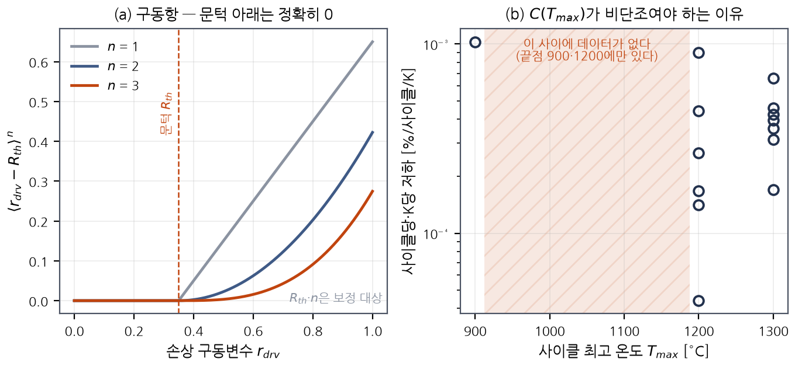
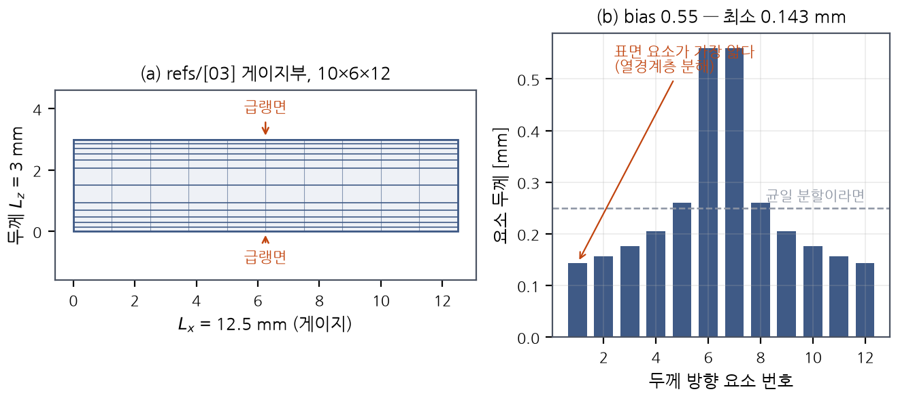
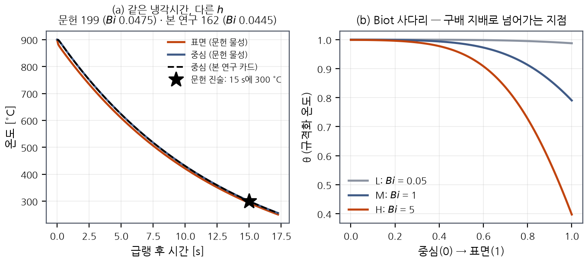

# 제5장 거시 반복 열충격 해석 모델

> **문서 성격:** 석사학위논문 제5장 초안 (v1, 2026-07-30 작성).
> 본 장은 **모델과 해석 설계**를 서술한다. 결과는 제6장에 있다.
> 본 장에 적힌 덱 구성은 전부 `abaqus/make_macro_thermalshock.py`가 실제로
> 생성하는 것이며, 인용된 수치는 그 스크립트와 `abaqus/quench_calibration.py`의
> 출력에서 온다. 아직 실행되지 않은 것은 §5.9에 명시하였다.

---

## 5.1 이 장이 하는 일

제4장은 RVE를 가상 시험기로 써서 균질화된 열-기계 물성과 손상 거동을 얻었다.
본 장은 그 물성을 받아 **부품 크기의 시편이 반복 열충격을 겪는 해석**을 구성한다.
제1장 §1.3의 세부 목표 3에 해당한다.

거시 모델이 반드시 해내야 하는 것은 세 가지이다.

| 요구 | 왜 필요한가 | 어디서 처리하는가 |
|---|---|---|
| **공간 온도구배를 푼다** | 기여 C2. 균일 온도 가정[17]이 깨지는 지점을 정량화하려면 구배를 실제로 풀어야 한다 | §5.4 과도 열전달 |
| **동일 진폭 반복에서 손상이 자란다** | 제1장 §1.2.3. 단조 CDM은 2번째 사이클부터 멈춘다(drift = 0.00e+00) | §5.2 사이클 손상 |
| **TRS 처리 3케이스를 구분한다** | 기여 C1, 본 연구의 주 주장 | §5.6 `freeze_step` |

### 5.1.1 설계를 지배한 제약 — 해석 1회당 정보량

Abaqus 해석은 느리다. 9-케이스 매트릭스를 관측량 하나당 한 잡씩 돌리면
계산이 끝나지 않는다. 따라서 본 장의 덱 구성은 **한 잡에서 최대한 많은 관측량을
뽑는 것**을 원칙으로 설계되었으며, 그 결과가 다음 세 가지이다.

1. **열해석을 공유한다.** 온도장은 TRS 처리 방식과 **무관**하므로, 심각도 1수준당
   열 잡 **1개**를 계산해 그 수준의 모든 TRS 케이스가 읽는다.
   3 심각도 × 3 TRS = 역학 잡 9개이지만 **열 잡은 3개**이다.
2. **탄성 프로브를 끼워 넣는다.** 체크포인트마다 미소 변형 스텝을 삽입하여
   **같은 잡 안에서** $E(N)$ 곡선을 얻는다(§5.5.3).
3. **체크포인트마다 restart를 쓴다.** 잔여강도 시험은 시편을 파괴하므로 끼워 넣을
   수 없다. 대신 restart에서 이어지는 짧은 별도 잡으로 처리하여, **사이클 0부터
   다시 계산하는 일이 없게** 한다(§5.5.4).

---

## 5.2 거시 구성모델 — `KMACRO31`

거시 재료는 제3장에서 검증된 V3_0 UMAT의 `KMACRO31` 분기를 쓴다. 미시 UMAT과
같은 소스, 같은 검증 체계 안에 있으며, 카드 가드 상수 `PROPS(36) = 31.0`으로
미시 카드와 구분된다.

### 5.2.1 사이클 손상 법칙



**그림 5.1** (a) 사이클 손상 법칙의 구동항 — 문턱 아래에서 정확히 0이고, 지수 $n$이 문턱 근처의 민감도를 정한다. (b) 같은 문헌 데이터를 $\Delta T$가 아니라 사이클 최고 온도로 다시 자른 것. 900 °C와 1200 °C 사이에는 측정이 없으며, 이 창이 $C(T_{max})$의 비단조 봉우리가 놓이는 곳이다.

제1장 §1.2.3에서 확인한 제약 — 단조 CDM은 동일 진폭 반복에서 $N=2$부터 손상이
자라지 않는다 — 을 해소하기 위해, 이력 최대값이 아니라 **사이클 수 자체**로
구동되는 손상항을 도입한다.

$$\Delta d_{cyc} = C(T)\,\langle r_{drv} - R_{th}\rangle^{\,n}\,(1-d_{cyc})^{-k}\;\Delta N$$

$$1 - d_{tot} = (1-d_{mono})\,(1 - w\,d_{cyc})$$

여기서 $r_{drv}$는 손상 구동변수, $R_{th}$는 문턱값, $\langle\cdot\rangle$은
Macaulay 괄호이다. 단조 손상 $d_{mono}$와 **곱셈으로 결합**하므로, 사이클 항을
꺼도($C=0$) V1_0 거동으로 정확히 환원된다.

> **★ $C(T)$의 $T$는 순간 온도가 아니라 사이클의 최고 온도다 (2026-08-06).**
> 심각도 역설 — refs/[3]의 $\Delta T$=600 °C 사이클이 refs/[2]의
> $\Delta T$=1000 °C보다 **사이클당·K당 6.05배** 손상적 — 은 $\Delta T$에도
> 순간 온도에도 단조인 어떤 법칙으로도 재현되지 않는다. 지배 기구가 열응력이
> 아니라 **최고 온도의 화학**이기 때문이다(900 °C: 탄소 산화 + 실리카 미유동;
> 1300 °C: 실리카 유동 = 자가치유). 그래서 KMACRO31은 $f_C$ 열을 **그 스텝이
> 도달한 최고 온도**(SDV 29 `TWMAX`, 스텝 시작마다 리셋)에서 평가하고, 탄성·
> 강도 열은 순간 온도를 그대로 쓴다. $C(T)$ 표는 **비단조**를 허용해야 하며
> (900–1200 °C 봉우리), 제3장 T9가 이 기구로 역설의 **부호**가 재현됨을
> 검증한다. 크기(6.05배)는 보정이 정한다.

### 5.2.2 지수 $k$의 부호가 두 실험을 가른다

이 법칙에서 가장 중요한 것은 지수 $k$이다. $(1-d_{cyc})^{-k}$ 항의 부호가
**손상 누적의 곡률**을 정한다.

| $k$ | $d_{cyc}$가 커질 때 | 물리적 기구 | 대응 문헌 (최고 온도) |
|---|---|---|---|
| $k < 0$ | 증가율이 **감소** → 포화 | 실리카가 균열을 **밀봉**하여 산소 침투 둔화 | Yin 등[2] (**1300 °C**) |
| $k = 0$ | 선형 | — | (기준선) |
| $k > 0$ | 증가율이 **증가** → 가속 | **밀봉 실패** — 균열이 통로로 남아 자기가속 | Zhang 등[3] (**900 °C**) |

> **★ 부호를 가르는 것은 아키텍처가 아니라 최고 온도이다**(제2장 §2.5.4).
> 초기 서술은 이를 "포화(3D) 대 가속(2D)"으로 두었으나, 그것은 두 데이터셋의
> **온도역 차이를 아키텍처 차이로 오귀속한 것**이다. SiC 산화가 만드는 실리카는
> 약 1000–1100 °C 이상에서 비로소 균열을 메울 양과 유동성을 갖는다. 결정적 증거는
> **Mei 등[43]**이다 — **아르곤** 분위기에서 1200 °C까지 올려도 **98.90 %가 유지**된다.
> **온도만으로는 손상이 누적되지 않으며 산소가 있어야 한다.** 따라서 $k$는 재료
> 상수가 아니라 **$k(T_{max})$** 로 두는 편이 방어하기 쉽고, 이는 노벨티를 깎지 않고
> **강화**한다 — 부호가 바뀌는 **이유**를 모델이 갖게 되기 때문이다.

제1장 §1.1.3과 제2장 §2.4.2에서 본 **두 문헌 데이터셋의 불일치가 여기서 해소된다.**
하나의 구성식이 지수 하나의 부호로 두 거동을 모두 표현하며, 그 부호가 곧
**어느 기구가 지배하는가**에 대한 진술이 된다. 두 데이터셋을 각각 맞추어 얻은
$k$의 부호가 실제로 갈라지는지가 제6장의 확인 항목이다.

> **본 연구가 보정하는 것은 한 온도역뿐이다.** 기준 조건은 900↔300 °C(Zhang 등[3]과
> 동일)이므로 $k>0$을 보정하고, [2]의 1300 °C는 **부호가 실제로 갈리는지의 정성
> 확인**으로만 쓴다. $k$를 온도의 연속 함수로 두는 것은 향후과제이며 §5.9.2에
> 한계로 기록한다.

> **이것이 제1장 §1.2.3 표의 대안 B이다.** 대안 A(요소 파손 후 응력 재분배[17])와
> 달리, 손상이 구성식 수준에서 연속적으로 누적되므로 **균열대 정규화로 메시
> 독립성이 유지**되고, 사이클 점프로 다수 사이클을 다룰 수 있다.

### 5.2.3 균열 닫힘 — 기여 C3의 실행 장치

$$d_{\text{eff}} = \begin{cases} d & \varepsilon_n \ge 0 \\ d\,(1-H_{clo}) & \varepsilon_n < 0\end{cases}$$

급랭 반사이클에서 표면은 인장을, 급가열 반사이클에서는 압축을 받는다. $H_{clo}>0$
이면 압축 반사이클에서 손상이 강성에 미치는 영향이 회복되므로, **같은 $|\Delta T|$
라도 두 반사이클의 손상 기여가 달라진다.** 이것이 제1장 §1.4의 C3이 예측하는
비대칭이며, 본 장의 덱은 $H_{clo}$를 켜고 끄는 것만으로 그 비대칭을 분리할 수 있다.

> **★ 급가열 반사이클이 특히 강하게 회복되는 이유가 실측되어 있다.** Li 등[28]은
> 본 연구와 동일 아키텍처의 재료에서 강성 회복이 **두 단계**임을 보인다 — 종방향 압축이
> 기지 균열을 닫고, 여기에 더해 **횡방향 압축이 박리된 계면까지 닫아 계면의
> 하중전달 능력을 되살린다.** 그 결과 **이축 압축에서 비활성화 속도가 더 빠르다.**
> 평판 표면의 급가열 반사이클은 두 면내 방향이 함께 구속되므로 **정확히 그 이축
> 압축 상태**이다. 따라서 C3의 비대칭 주장은 단축 실험의 외삽이 아니라
> **관측이 이루어진 것과 같은 응력상태에서의 관측**에 근거한다(제2장 §2.8.3).

**전단 손상은 회복시키지 않으며, 저장된 손상 이력 $d$는 건드리지 않는다** —
닫힘은 시컨트 강성만 바꾸고 손상의 단조성은 보존된다(제3장 §3.4.2).

> **이 전단 가정은 [28]과 어긋나며, 의도적으로 보수적이다.** 같은 논문은 동일 재료에서
> *"the shear damage is also gradually deactivated"* 를 관측한다. 다만 그 회복을
> 구동하는 것은 **전단이 아니라 수직 압축**이므로(계면 폐합 → 하중전달 회복),
> 올바른 확장은 전단 부호가 아니라 **$\varepsilon_n<0$ 아래에서 전단 손상에도 독립
> 계수 $H_{clos}$를 두는 것**이다. 본 연구는 $H_{clos}=0$을 유지하며, 이는 강성 회복을
> 과소평가 → **급가열 반사이클의 손상 기여를 과대평가**하는 방향이므로 C3 결론에
> 대해 보수적이다. 카드 슬롯 설계에는 반영해 두고 민감도 항목으로 남긴다(§5.9.2).

### 5.2.4 파손기준 세 개의 병렬 평가 — 기여 C4

`KMACRO31`은 Hashin / Tsai–Wu / D-criterion을 **동시에** 평가한다. 손상은 여전히
Hashin만이 구동하므로 **기준을 켜도 응력과 강성이 비트 단위로 동일**하며(제3장
§3.4.5), 비교 비용이 실제로 0이다. 세 지수는 모두 하중 배수로 정규화되어 직접
비교 가능하다.

카드에 `ICRIT > 0`을 주면 `*Depvar`가 **29 이상**이어야 하며(2026-08-06부터 모든 거시 카드가 29 — SDV 29가 사이클 심각도 창 `TWMAX`), 이는 §5.8의 정적
검증이 강제한다.

---

## 5.3 시편과 메시

### 5.3.1 형상은 문헌에서 가져온다

검증 대상 두 실험의 시편 치수를 그대로 쓴다. **임의로 만든 형상이 아니다.**

| 케이스 | 출처 | 모델 치수 (mm) | 요소 분할 | 체크포인트 |
|---|---|---|---|---|
| `ZHANG2013` | refs/[3] | 12.5 × 6.0 × **3.0** | 10 × 6 × 12 | 20 / 40 / 60 |
| `YIN2002` | refs/[2] | 20.0 × 6.0 × **4.0** | 12 × 6 × 14 | 20 / 50 / 100 |

세 번째 치수가 **두께이자 급랭 방향**이다.

- `ZHANG2013`은 전체 122 mm 시편의 **게이지부만** 모델링한다. 인장시험이 측정하는
  곳이자 파손이 일어나는 곳이며, 열 문제가 두께 방향이므로 어깨부가 이를 바꾸지
  않는다.
- `YIN2002`는 140 mm 봉의 **3점 굽힘 스팬(20 mm)**만 모델링한다.
  **단, 이 시험의 잔여물성은 굽힘강도이므로 급랭 후 프로브가 인장이 아니라 굽힘
  이어야 한다. 이는 아직 구현되지 않았다**(§5.9-3).

### 5.3.2 두께 방향 메시는 열경계층이 정한다



**그림 5.2** (a) refs/[3] 게이지부의 거시 모델과 두께 방향 bias 메시. (b) 두께 방향 요소 두께 — 급랭면 쪽이 가장 얇아 열경계층을 분해한다. 치수·분할·bias는 모두 `abaqus/make_macro_thermalshock.py`의 값이다.

거시 메시는 **RVE와 무관하게** 결정된다. 제약이 다르기 때문이다 — RVE는 얀/기지
형상을 풀어야 하고, 거시 메시는 **급랭 열경계층을 풀어야 한다.**

두께 방향은 양쪽 표면으로 편향된 등급 메시를 쓴다.

$$z_i = \tfrac{L_z}{2}\Big[1 + \mathrm{sign}(x_i)\,|x_i|^{\,b}\Big], \qquad x_i = \frac{2i}{n_z}-1$$

편향 지수는 $b = 0.55$이다. **$b < 1$이어야 표면에 모이고, $b > 1$이면 정반대로
중앙면에 모인다.** 스크립트는 $b \ge 1$을 예외로 거부한다 — 부호를 뒤집어 쓰면
에러 없이 경계층을 못 푸는 메시가 나오기 때문이다.

균일 메시를 쓰지 않는 이유는 단순하다. 급랭 중 온도구배는 두께의 일부에만
존재하므로, 균일 메시는 **중앙부에 요소를 낭비하거나 표면 구배를 못 푸는** 둘 중
하나가 된다.

---

## 5.4 열해석 — 과도 열전달

### 5.4.1 대류계수는 논문의 냉각 시간에서 역산한다



**그림 5.3** (a) refs/[3]의 냉각 시간에서 역산한 대류계수로 계산한 온도 이력. 별표가 문헌 진술(15초에 300 °C)이다. **문헌이 적은 것은 $h$가 아니라 냉각 시간이므로, 어느 물성으로 역산하느냐에 따라 $h$가 갈린다** — 문헌 물성(refs/[3] $\rho$, refs/[20] $c_p$, refs/[12] $k$)이면 199 W/(m²·K)·$Bi$ = 0.0475, 본 연구 균질화 카드면 162 W/(m²·K)·$Bi$ = 0.0445이며 **두 곡선 모두 같은 별표를 지난다.** $Bi$가 낮아 표면·중심이 겹친다. 문헌 $h$를 본 연구 $\bar k_3$와 짝지으면 $Bi$ = 0.0548이 나오는데 이는 어느 재료의 값도 아니므로 그림에 넣지 않으며, 판정기가 이를 금지한다. (b) Biot 사다리 세 수준의 두께 방향 온도 분포.

문헌은 대류계수 $h$를 적지 않는다. 적는 것은 **"몇 초 만에 몇 도까지 식었다"**
이다. 따라서 $h$는 가정하지 않고, 1차원 과도 해를 풀어 **각 논문이 스스로 적은
냉각 시간을 재현하는 값**으로 역산한다(`abaqus/quench_calibration.py`).

역산은 **본 연구의 카드 위에서** 한다. 즉 $\bar\rho$ = 2008.2 kg/m³,
$\bar c_p$ = 681.3 J/(kg·K), $\bar k_3$ = 5.449 W/(m·K) — 모두 §4장의
균질화 결과다. 문헌 물성으로 역산한 값을 우리 $\bar k$와 섞으면 **어느 재료의
것도 아닌 조합**이 된다(그 조합은 $Bi$ = 0.0548을 준다).

| 케이스 | 프로토콜 | 역산된 $h$ | $Bi$ | 피크 구배 |
|---|---|---|---|---|
| `Z` = refs/[3] | 900 → 300 °C, 15 s, 철판 접촉, 두께 3 mm | 161.7 W/(m²·K) | **0.0445** | 18.7 K = 드롭의 **3.1 %** |
| `Y` = refs/[2] | 1300 → 300 °C, 60 s, 공기 중, 두께 4 mm | 70.8 W/(m²·K) | **0.0260** | 16.2 K = 드롭의 **1.6 %** |

> 참고로 문헌 자신의 물성(refs/[3] $\rho$ = 2050, refs/[20] $c_p$ = 820,
> refs/[12] $k_3$ = 6.29)으로 풀면 `Z`는 199.0 W/(m²·K), $Bi$ = 0.0475,
> `Y`는 87.0 W/(m²·K), $Bi$ = 0.0277 이 나온다.
> 결론은 바뀌지 않는다 — 두 값 모두 $Bi \ll 1$ 이다. 바뀌는 것은 **어느
> 재료의 수치인가**이며, 논문이 인용할 것은 우리 카드의 행이다.

**이 결과가 제2장 C2 주장의 수정 근거가 되었다.** 두 실험 모두 $Bi \ll 1$, 즉
**균일 온도 가정이 거의 옳은 영역**에 있다. 따라서 "선행연구가 구배를 무시해서
틀렸다"는 주장은 성립하지 않으며, 본 연구는 그렇게 주장하지 않는다(제1장 §1.2.2).

> **★ 이 역산은 본 연구가 만든 편법이 아니라 세라믹 열충격 문헌의 표준 방법이다
> (2026-08-03 확인).** Hugot & Glandus(*J. Eur. Ceram. Soc.* **27**(4) (2007)
> 1919–1925, PII `S0955221906004705`)는 알루미나를 압축공기로 급랭시키면서
> **$h$를 수치적으로 훑어 최대 인장응력이 재료 강도에 닿는 값을 찾는 방식으로
> $h$를 간접 추정**한다 — 관측된 임계 온도차를 재현하는 $h$를 역산하는, 본 절과
> **같은 구조의 절차**다. 그들이 얻은 임계 온도차는 **480 K**(원통, 강한 냉각)에서
> **650 K**(각형 단면, 중간 냉각)에 걸친다.
>
> **왜 모두가 이렇게 하는가.** $h$는 시편 형상·표면 상태·유동 조건에 함께 의존하므로
> 급랭 시험에서 **직접 측정되는 양이 아니다.** 문헌이 기록하는 것은 온도 이력이며,
> $h$는 그것을 재현하는 값으로만 정의된다. 따라서 **문헌에서 $h$ 값을 빌려오는 쪽이
> 오히려 근거가 약하다** — 그 값은 그 논문의 시편 형상에 붙어 있기 때문이다.
>
> ⚠️ **다만 $h$의 불확실성 자체는 남는다.** 본 연구가 이를 다루는 방식은 값을 더
> 정확히 맞추려 하는 것이 아니라, **$Bi$ 사다리(§5.4.2)로 $h$를 3자릿수 훑어
> 결론이 어디서 바뀌는지 보이는 것**이다. 즉 $h$의 불확실성은 오차가 아니라
> **조작 변수**로 전환되어 있다.

### 5.4.2 대신 사다리를 만든다 — 기여 C2

문헌 조건이 균일 영역에 있다면, 정량화할 가치가 있는 것은 **그 가정이 어디서
깨지는가**이다. 따라서 심각도를 둥근 숫자가 아니라 **Biot 수를 훑도록** 정의한다.

| 수준 | $h$ [mW/(mm²·K)] | $h$ [W/(m²·K)] | $Bi$ | 성격 |
|---|---|---|---|---|
| **L** | 1.816 × 10⁻¹ | 181.6 | **0.05** | refs/[3]이 실제로 있는 곳. 거의 균일 |
| **M** | 3.633 × 10⁰ | 3632.7 | **1** | 천이점. 구배가 드롭의 ~45 % |
| **H** | 1.816 × 10¹ | 18163.3 | **5** | 구배 지배 |

$h$는 **$Bi$에서 유도**한다: $h = Bi \cdot \bar k_3 / (L_z/2)$. 따라서 표의
$Bi$는 근사값이 아니라 **정의상 정확**하며, 시편 두께가 바뀌어도 그대로 유지된다.

> **단위 주의.** 덱의 단위계는 tonne–mm–s이므로 에너지가 mJ, 일률이 mW다.
> 따라서 열전도율은 **mW/(mm·K)** (= W/(m·K)와 수치가 같다), 대류계수는
> **mW/(mm²·K)** (= SI 값 ÷ 10³)이다. 2026-08-11 이전 이 문서와 덱 생성기는
> 둘 다 SI ÷ 10⁶ 를 썼는데, $h$와 $k$가 **같은 1000배로** 틀리면 $Bi$는
> 정확한 채로 남고 **Fourier 수만 1000배 작아진다** — 즉 급랭이 1000배 느리게
> 풀리면서 완벽하게 수렴한다. 그래서 덱 생성기는 $Bi$가 아니라 **열확산율과
> $Fo$**로 카드를 검사한다(`thermal_audit`).

전 수준 공통으로 900 → 300 °C이다. **온도 진폭을 고정하고 $h$만 바꾸므로,
관측되는 차이는 오직 구배에서 온다.** 진폭과 $h$를 같이 바꾸면 두 효과가 섞여
C2의 주장이 성립하지 않는다.

### 5.4.3 열전도율의 불확실성을 정직하게 다룬다

$Bi = h L_z / \bar k$ 이므로 위 사다리는 $\bar k$에 직접 의존한다. 그런데 $\bar k$는
본 연구에서 가장 불확실한 물성이다(제4장 §4.7). 같은 프로토콜을 $k$의 타당 범위
전체에서 다시 풀면:

| $k_3$ [W/(m·K)] | $h$ | $Bi$ | 피크 구배 | 성격 |
|---|---|---|---|---|
| **5.449** | **161.7** | **0.0445** | **18.7 K (3.1 %)** | **본 연구 균질화, 23 °C (판정선)** |
| **4.662** | **162.3** | **0.0522** | **21.9 K (3.6 %)** | **본 연구 균질화, 900 °C** — §5.4.3-a에서 유도 |
| 6.29 | 199.0 | 0.0475 | 19.9 K (3.3 %) | refs/[12] 상온 실측 (다른 시편) |
| 3.49 | 202.7 | 0.0871 | 35.6 K (5.9 %) | refs/[20] 적층판 상온 — **크기 하한 대용** |
| 2.04 | 337.1 | 0.2479 | **91.9 K (15 %)** | refs/[20] 적층판 1473 K — **크기 하한 대용** |

**이 표는 $\bar k_3$의 크기가 얼마나 불확실한가를 보이는 것이지, 우리 재료가
온도에 따라 어디로 가는지를 보이는 것이 아니다.** 두 가지를 갈라 읽어야 한다.

- **온도 의존(형상)**은 위 두 행이 답한다. 우리 카드의 900 °C 값은 4.662이고
  피크 구배는 18.7 → **21.9 K**로 커진다(§5.4.3-a에서 구성재로부터 유도).
- **크기 불확실성**은 아래 세 행이 답한다. 공극률 분쟁(강성 32.4 % 대 열전도
  23.8–25.4 %, 제4장 §4.7)이 열려 있는 한 $\bar k_3$의 크기 자체가 확정되지
  않았으므로, refs/[20] 적층판의 두 값을 **다른 재료임을 알고도** 하한 대용으로
  남긴다. 마지막 행에서 구배가 상온 대비 **4.6배**가 되는데, 이는 "우리 재료가
  고온에서 그렇게 된다"가 아니라 **"$\bar k_3$가 그만큼 작을 수도 있다면"** 이라는
  뜻이다.

> **2026-08-11 이전 이 절은 마지막 행을 두고 "고온 행이 물리적으로 옳은 쪽"이라고
> 적었다. 그 문장은 삭제한다.** 그것은 refs/[20] 적층판의 **고온 크기**를 우리
> 시편의 **온도 의존**으로 읽은 것이고, §5.4.3-a의 유도가 그렇지 않음을 보인다 —
> 우리 기지는 CVI SiC라 저항의 91.5 %가 온도 무관이고, 900 °C에서도 $\bar k_3$는
> 2.04가 아니라 4.66이다. 크기 하한과 온도 의존을 같은 열에 놓았던 것이 원인이다.

따라서 본 연구가 주장하는 것은 **전 범위에서 살아남는 더 약한 명제**이다:
크기가 하한 대용까지 내려가도 $Bi < 0.25$ 이므로 구배는 드롭의 소수 비율이며,
문헌 조건에서 균일 가정은 **대체로 정당하다.** 그리고 우리 카드 자신의 값으로는
900 °C에서도 $Bi$ = 0.052로 훨씬 여유가 있다. 이 표를 평균내지 않고 행별로,
그리고 **형상 행과 크기 행을 나누어** 읽는 것이 요점이다.

### 5.4.3-a $k(T)$의 **형상**은 빌리지 않고 유도한다 (2026-08-11 판정)

위 표는 $\bar k$의 **크기** 불확실성을 다룬다. 그와 별개로 카드는 $\bar k$가 온도에
따라 **어떻게 변하는가** — 형상 — 를 정해야 한다. 초기 거시 열카드는 그 형상을
refs/[20] Table 1의 296 K→1473 K 비 $2.04/3.49 = 0.5845$ 에서 **비율만 빌려**
썼다. 그러나 refs/[20]은 다른 재료(8HSW 적층판, $\rho$ = 2.64 g/cm³, $V_f$ = 46.4 %)의
**복합재 측정값**이므로, 카드 적법성 판정이 필요했다. 판정 결과는 **차용 기각**이며,
근거는 빌릴 필요가 없다는 것이다 — 형상은 카드 자신의 구성재에서 유도된다
(`data/properties/conductivity_temperature.py`, 검증 37항목).

**1. 함수 형태는 선택이 아니다.** Snead 상관식(refs/[06] Eq. 12, 이미 게이트 안에
있다)은 그 자체가 **열저항 선형** 형태이다.

$$\frac{1}{k(T)} = R_0 + c\,T, \qquad R_0 = 3.0\times10^{-4},\;\; c = 1.05\times10^{-5}\ \mathrm{m\!\cdot\!K/W}$$

$R_0$는 결함·경계·계면이 만드는 **온도 무관** 항이고, $c\,T$가 온도에 따라 떨어지는
유일한 항(Umklapp 포논 산란)이다. 그리고 **같은 형태를 같은 아키텍처에서 쓴 1차
출처가 있다** — Katoh 등[13]은 **2D CVI 직조** 복합재를 모델링하며 *"linearly
temperature dependent reciprocal thermal diffusivity was assumed for both matrix
and fibers … the coefficient of thermal resistance was taken to be 0.01 s/cm²·K"*
라고 적는다(p. 941). 즉 형태는 빌린 것이 아니라 **두 1차 출처가 합의하는 것**이다.

**2. 우리 카드의 기지는 단결정이 아니다.** RVE 열전도 덱은 refs/[17]의 CVI SiC 기지
$k$ = 25 W/(m·K) 위에 세워져 있다(그 덱의 판정기가 *"not Snead's 293"* 으로 못박는다).
단결정은 296 K에서 293.4이므로 CVI 기지는 **11.7배** 더 나쁘게 통하며, 위 가법 저항
모형에서 그 차이는 곧 **저항의 91.5 %가 온도 무관**이라는 뜻이다. 따라서 기지 $k$는
296→1473 K에서 **0.764로만** 떨어진다 — 단결정이라면 갔을 0.216이 아니다.

**3. 같은 균질화로 넘기면 복합재 비율이 나온다.** 결과는 네 추정자 전부에서
**0.779–0.840**(대표 0.82)이고 추정자 간 폭이 0.061에 불과하다 — **크기는 논쟁 중이지만
형상은 견고하다.** 그리고 이 해석 경로는 296 K에서 $\bar k_3$ = 5.514를 주어 RVE_COND
잡이 실제로 낸 **5.449와 1.2 % 차**다. 경로가 스스로를 검증한다.

**4. 빌려온 0.5845가 무엇이었는지도 밝혀진다.** 같은 유도를 refs/[13]의 **더 조밀한**
CVI 기지(70 W/(m·K))로 돌리면 0.547–0.612가 나와 **0.5845를 정확히 감싼다.** 즉 그
형상은 **우리 카드가 쓰지 않는 기지**를 전제한 것이며, 다른 재료라서가 아니라
**카드 안에서 자기모순이기 때문에** 기각된다.

| $T$ [°C] | 본 연구 유도 | refs/[20] 차용 | 상수 $k$ |
|---|---|---|---|
| 23 | 1.0000 | 1.0000 | 1.0000 |
| 300 | 0.9480 | 0.9022 | 1.0000 |
| 500 | 0.9145 | 0.8316 | 1.0000 |
| **900** | **0.8556** | 0.6904 | 1.0000 |
| 1200 | 0.8173 | 0.5845 | 1.0000 |

**5. 틀리는 방향이 나쁜 쪽이었다.** 급랭이 시작되고 구배가 최대가 되는 900 °C에서:

| 900 °C에서의 형상 | $\bar k_3$ | $Bi$ | 피크 구배 |
|---|---|---|---|
| **본 연구 유도 (판정선)** | **4.662** | **0.0522** | **21.9 K** |
| refs/[20] 차용 | 3.762 | 0.0651 | 27.0 K |
| 상수 $k$ (`--no-kt`) | 5.449 | 0.0445 | 18.7 K |

차용은 $Bi$를 **23.9 % 높게**, 상수 $k$는 **14.4 % 낮게** 준다. 차용 쪽이 오차가 클
뿐 아니라 **구배를 실제보다 크게** 만들어 기여 C2("구배가 중요해지는 지점")를
**본 연구에 유리한 쪽으로 편향**시킨다. 보수적 오차보다 나쁜 종류의 오차이므로
반드시 피해야 한다. 상수 $k$가 "중립적 기본값이 아니라 선언되지 않은 가정"이라는
지적은 옳았으나, 두 오차 중에서는 **작은 쪽**이다.

> **이 판정이 §5.4.3 표를 바꾸는 부분.** 그 표의 마지막 행(2.04 W/(m·K), 피크 구배
> 91.9 K)은 **refs/[20] 적층판의 고온 크기**를 우리 시편에 대입한 것이다. 본 절의
> 유도에 따르면 우리 복합재의 900 °C 값은 2.04가 아니라 **4.66**이며, 그때 피크 구배는
> 91.9 K가 아니라 **21.9 K**이다. §5.4.3 표는 **크기 불확실성의 상·하한**으로서 그대로
> 유지하되(공극률 분쟁이 열려 있으므로 $\bar k_3$ 크기 자체가 논쟁 중이다),
> **"고온 행이 물리적으로 옳은 쪽"이라는 문장을 형상 근거로 읽어서는 안 된다** —
> 그 행은 크기 가정이지 온도 의존이 아니다.

**남는 가정과 그 폭.** 저항 분해는 25 대 293의 간극 **전부**가 온도 무관이라고 본다.
이는 이 분야의 표준 처리이며(Snead의 조사와 refs/[13]의 조사 손상 적합
$1/K_{rd} = 0.119 - 1.13\times10^{-4}T$ 둘 다 결함 저항을 격자 항에 **더한다**),
가정이 완전히 깨지면 비율은 0.82가 아니라 0.216이 된다 — 그것이 이 가정의 전 폭이며
숨기지 않고 CSV에 적는다. 섬유 **횡**방향 $k$의 온도 의존은 출처가 없어 상수로 두었고,
섬유 축방향은 refs/[09]를 통해 3.3배 **상승**하는 것을 반영했다. 공극 전도는 0.025로
고정했는데, 고온에서 공극을 가로지르는 **복사**가 $T^3$로 자라 실제 곡선을 더 **평탄**
하게 만들므로, 유도값 0.82는 평탄함의 **하한**이다 — 참값은 유도값과 상수 $k$ **사이**에
있지 그 아래가 아니다.

### 5.4.4 한 사이클의 구성

각 사이클은 두 스텝이다.

```
*Step, Name=Quench_<c>      *Heat Transfer, end=PERIOD, deltmx=25.
  *Sfilm  SURF_LO/HI, F, T_lo, h        ← 양면 급랭
*Step, Name=Reheat_<c>      *Heat Transfer, end=PERIOD, deltmx=25.
  *Sfilm  SURF_LO/HI, F, T_hi, h        ← 양면 재가열
```

`deltmx = 25`는 증분당 절점 온도 변화를 25 K로 제한하여 과도 해가 시간적으로도
분해되게 한다. 출력은 절점 온도 `NT`와 열유속 `HFL`이며, 표면·중앙 절점의 `NT`를
history로 남겨 §5.8-1의 경계층 확인에 쓴다.

---

## 5.5 역학해석

### 5.5.1 온도장을 열 잡에서 읽는다

```
*Temperature, file=<heatjob>.odb, bstep=<1 or 2>, estep=<same>
```

급랭 반사이클은 열 잡의 스텝 1을, 재가열 반사이클은 스텝 2를 읽는다.
**모든 역학 사이클이 같은 열 스텝을 읽으므로, 열하중은 사이클마다 정말로 동일하다.**
이것이 의도한 바이다 — 동일 진폭 반복이야말로 §5.2.1의 사이클 손상항이 존재하는
이유인 shakedown 상황을 만든다.

> **§5.8-2가 확인하는 것이 바로 이 지점이다.** 스텝/시간 매핑이 실패하면 Abaqus는
> 경고를 내지만 **조용히 초기 온도를 유지**하며, 그것은 수렴한 채로 틀린 답처럼
> 보인다.

경계조건은 최소 구속(`XLO,1` `YLO,2` `ZLO,3`)만 주어 **강체운동만 막고 열변형은
자유롭게 둔다.** 구속을 더 주면 열응력이 인위적으로 증폭된다.

### 5.5.2 사이클 점프

100 사이클을 전부 명시적으로 푸는 것은 비현실적이다. 따라서 한 증분이 여러
사이클을 대표하도록 **사이클률**을 필드 변수로 준다.

```
*Field, variable=1
ALLNODES, <rate>          ← 단위시간당 사이클 수, KMACRO31이 PREDEFN=1로 읽음
```

블록당 실제 계산 사이클 수 $n_{sim}$과 대표 사이클 수 $n_{blk}$의 비가 점프 배율이며,
$\Delta N = \text{rate} \times \Delta t$로 누적된다.

> **사이클 카운트는 Quench 반쪽에만 싣는다 (2026-08-06).** Quench 스텝은
> $T_{hi}$에서 **시작**하므로 심각도 창(SDV 29)이 첫 증분부터 사이클의 최고
> 온도와 일치하고, $r_{drv}$ 구동은 $T_{hi} \to T_{lo}$ 전 구간을 그대로 쓸어
> 담는다(Reheat의 응력 상태는 그 역순이라 같은 집합이다). Reheat 스텝은
> rate = 0으로 사이클을 세지 않는다 — 창이 $T_{lo}$부터 차오르는 동안
> 비단조 $C(T)$의 봉우리를 상승 통과마다 잘못 먹는 것을 막는다. 생성기
> 자체시험이 방출된 덱 텍스트에서 이 배치를 직접 검사한다.

**정확도는 재료점 수준에서 이미 검증되어 있다**(제3장 T6):

| 조건 | 오차 |
|---|---|
| $k = 0$ (선형 누적) | **1.53 × 10⁻¹⁶** — 점프가 정확 |
| $k > 0$, 배율 ×10 | **0.03 %** |

단, **구조 수준의 오차는 재분배를 포함하므로 별도로 한 번 측정해야 한다**(§5.8-3).
재료점 오차가 작다는 것이 구조 오차가 작다는 것을 보장하지 않는다.

#### 5.5.2-a 점프 간격은 고정이며, 그것이 이 절의 한계이다

본 연구의 점프 배율은 **해석 전에 정해 두는 고정값**이다. 이 선택을 문헌에 비추어
정확히 위치시키면 다음과 같다.

| | 무엇을 묶는가 | 점프 폭을 어떻게 정하는가 |
|---|---|---|
| Van Paepegem 등[57] | **손상 증분 $\Delta D$** | $dD/dN$으로 **앞으로 계산**하여 적응 |
| Cojocaru & Karlsson[58] | **변화율(기울기)의 변화** | 상대오차 허용치로 적응 |
| **본 연구** | **손상 증분 $\Delta D$** | **고정**, 초과 시 컷백 |

**주목할 것은 첫 행이다.** [57]의 적응 기준은 다름 아닌 **손상 증분의 상한**이며
(그들의 §6.1: 손상변수의 허용 증가량을 부과하고 $D(N{+}N_{jump}) = D(N) +
(dD/dN)N_{jump}$로 전진), 이는 본 연구의 `max_djump`와 **같은 기준**이다. 따라서
[57]은 "구현하지 않은 대안"이 아니라 **본 연구가 쓰는 기준의 출처**이다.

**두 가지를 정직하게 적는다.**

1. **허용치가 10배 느슨하다.** [57]이 예시로 드는 값은 $\Delta D \le 0.01$
   ($D \in [0,1]$)이고, 본 연구의 `max_djump`는 **0.10**이다. 이 차이는 서술로
   가릴 것이 아니라 숫자로 적어야 한다.
2. **기준이 아니라 기구가 다르다.** [57]은 $dD/dN$에서 점프 폭을 **앞으로 계산**하고,
   본 연구는 간격을 고정한 뒤 초과가 나면 **뒤에서 컷백**한다. 반응형 제한은
   증분당 손상을 허용치 안에 묶지만 **점프 폭을 고르지는 못한다.** 이것이 본 절의
   한계의 정확한 형태이다.

[58]은 성격이 다르다. 그 제어함수는 손상의 크기가 아니라 **변화율의 변화**를
$|s_p - s_{12}|/|s_{12}| \le q_y$ 로 묶으며(직전 두 사이클의 기울기에서 선형 외삽),
본 연구도 [57]도 이것을 하지 않는다. **[58]이야말로 "더 나은 방법이 있으나 구현하지
않았다"의 인용처이다.**

> **한 가지는 적응형으로 가도 남는다.** [57]은 유한요소 해석이 국부 요구가 서로
> 달라도 **전역 점프 폭을 하나만** 가질 수 있고 그 요구들이 "매우 상충할 수 있다"고
> 적는다. 본 연구의 RVE·거시 모델은 기지와 얀의 손상 속도가 크게 다르므로 정확히
> 그 상황이며, 따라서 **단일 간격이라는 제약 자체는 본 연구의 단순화가 아니라
> 적응형에서도 살아남는 것**이다. 적응화가 고치는 것은 그 하나의 값을 **누가
> 정하는가**이다.

> **⚠️ 두 편 모두 재료 데이터의 출처가 아니다.** [57]은 평직 유리/에폭시로,
> [58]은 열차폐코팅으로 검증되었다. 본 연구가 가져오는 것은 **수치 적분 기법**
> 뿐이며(점프당 $\Delta D$ 허용치는 상미분방정식 적분에 관한 진술이지 유리섬유에
> 관한 진술이 아니다), 두 논문에서 **물성값은 일절 취하지 않는다.**
> 판정기: `python3 data/literature/cycle_jump_provenance.py --check` (27항목)

### 5.5.3 탄성 프로브 — $E(N)$을 같은 잡에서 얻는다

체크포인트마다 다음 스텝을 삽입한다.

```
*Step, Name=Probe_N<n>
*Static
*Boundary, op=NEW
XLO, 1 / YLO, 2 / ZLO, 3
XHI, 1, 1, <1e-6 * Lx>        ← 변형률 1e-6
*Field, variable=1
ALLNODES, 0.                   ← 사이클률 0
```

이 스텝이 손상을 만들지 않는 이유는 **두 가지가 동시에 성립하기 때문**이다.

1. 변형률 $10^{-6}$은 어떤 손상 문턱보다도 수 자릿수 아래이므로 $d_{mono}$가
   자라지 않는다(구동변수가 이력 최대값이므로 그 아래는 아무 일도 없다).
2. 사이클률이 0이므로 $\Delta d_{cyc} = C\langle\cdot\rangle^n(1-d_{cyc})^{-k}\cdot 0 = 0$이다.

따라서 `XHI`의 반력이 **현재 시컨트 강성**을 그대로 준다.
**$E(N)$ 곡선이 추가 해석 없이 같은 잡에서 나온다.**

> `*Boundary, op=NEW`가 중요하다. Abaqus에서 경계조건은 스텝을 넘어 유지되므로,
> `op=NEW` 없이는 직전 프로브의 변위가 다음 사이클 스텝까지 살아남는다.

이 관측량이 곧 refs[3]의 1차 측정량(사이클 수 대 잔여탄성계수)이므로,
**모델과 실험을 같은 축에서 직접 비교**할 수 있다.

### 5.5.4 잔여강도 — restart로 분리한다

잔여강도 시험은 시편을 파괴하므로 프로브처럼 끼워 넣을 수 없다. 대신 프로브
스텝마다 `*Restart, write, overlay`를 남기고, 체크포인트별로 **별도의 짧은 잡**이
그 지점에서 이어받아 파괴까지 인장한다(목표 변형률 1 %).

```
*Restart, read, step=<프로브 스텝 번호>
```

**사이클 0부터 다시 계산하는 일이 없다.** 체크포인트 3개면 잔여강도 잡 3개가
붙지만, 각각은 사이클 이력이 아니라 단조 인장 하나만 푼다.

### 5.5.5 출력

필드 출력에 `SDV` **전체**를 포함한다. 나중에 "그 변수를 안 뽑았다"는 이유로
9-케이스 매트릭스를 재실행하는 것이 가장 큰 낭비이기 때문이다.

history 출력에는 비교에 필요한 상태변수를 매 프레임 남긴다.

| SDV | 내용 |
|---|---|
| 9, 10 | 손상 성분 |
| **17** | $d_{cyc}$ — 사이클 손상 |
| **18** | 누적 사이클 수 $N$ |
| 19 | Hashin 지수 (손상을 **구동**) |
| **23 / 24** | Tsai–Wu / D-criterion 지수 (수동 평가) |
| 25 | 래치 비트합 (1=Hashin, 2=Tsai–Wu, 4=D) |

19·23·24를 매 프레임 남기는 것이 기여 C4의 비교를 가능하게 한다.

---

## 5.6 TRS 3케이스의 구현 — 기여 C1

제1장 §1.4의 3케이스를 덱에서 다음과 같이 구분한다.

| 케이스 | 제조 냉각 스텝 | `freeze_step` = `PROPS(26)` | 결과 |
|---|---|---|---|
| **A. 미반영** | **없음** (`*Expansion` 자체를 주지 않음) | — | $T_{hi}$에서 무응력 시작 |
| **B. 초기 반영** | 1050 °C → $T_{hi}$ 1회 | **1.0** | 손상이 스텝 1에서 **동결** → TRS가 초기조건으로만 작용 |
| **C. 완전 반영** | 1050 °C → $T_{hi}$ 1회 | 기본값 (동결 없음) | 손상이 계속 살아 있어 TRS가 **이완·재분배** |

`KMACRO31`은 `KSTEP ≤ freeze_step`인 동안에만 손상을 진전시킨다. 따라서 B는
제조 냉각으로 생긴 손상과 잔류응력을 **그 상태로 얼려** 이후 사이클에 넘긴다.

> **이 패치가 없으면 B와 C는 완전히 같은 덱이 된다.** 스크립트는 케이스 B에
> 대해서만 카드 슬롯 26을 1.0으로 바꾸며, 그 외 슬롯은 손대지 않는다.

**B와 C의 차이가 곧 본 논문이 정량화하려는 양이다**(제1장 §1.4의 C1). A는 기준선
이다 — 문헌에서 흔한 단순화이며, A와 B의 차이는 "TRS를 넣었는가", B와 C의 차이는
"TRS를 살려 두었는가"를 각각 분리해 보여준다.

---

### 5.6.1 어느 물성 구성으로 도는가 — CONFIG_P

**본 매트릭스는 CONFIG_P로 돈다**(제4장 §4.9-11). TRS 크기 자체가 §5.6이 비교하는
대상이므로, TRS가 2.34배 부풀려진 채로는 A/B/C의 차이도 같은 배수만큼 부풀려진다.
CONFIG_P는 `*Expansion, zero=` **782 °C**와 실측 구성재 CTE를 쓰며 기지 TRS가
XRD 실측과 **1.00×**로 일치한다.

> **782 °C는 보정값이다.** 3D 브레이드 재료의 XRD 1점에 맞춘 값이고 본 연구는
> 2D 평직이다. 따라서 **한 심각도(중간)에서 세 TRS 처리를 CONFIG_V(1050 °C,
> Zhang 카드)로도 돌려 순위가 바뀌지 않음을 보인다.** 역학 잡이 9 → **12개**로
> 늘지만, 이것이 C1의 결론을 보정 파라미터로부터 분리하는 값이다.
>
> 두 구성은 **`*Expansion` 블록과 CTE 표에서만** 다르다. `zero=`와 표의 할선값은
> 하나의 결정이므로 `build_temperature_tables.py`가 단일 `T0`로 둘을 함께 몬다 —
> **`zero=`만 손으로 고친 덱은 무효다.**

---

## 5.7 해석 매트릭스와 계산 비용

| 잡 종류 | 개수 | 근거 |
|---|---|---|
| 열전달 | **3** | 심각도당 1개, 모든 TRS 케이스가 공유 |
| 역학 (CONFIG_P) | **9** | 3 심각도 × 3 TRS |
| 역학 (CONFIG_V 대조) | **3** | 중간 심각도 × 3 TRS — 순위 불변 확인(§5.6.1) |
| 잔여강도 (restart) | 9 × 체크포인트 수 | 부모 역학 잡 이후 |

CONFIG_V 대조 3잡은 **열전달 잡을 CONFIG_P와 공유한다** — 온도장은 열물성만으로
정해지고 `*Expansion`은 열해석에 들어가지 않기 때문이다. 즉 대조군의 추가 비용은
**역학 3잡뿐**이다.

의존 관계는 다음과 같다.

```
HEAT_S<sev>  ──┬──> MECH_S<sev>_TRSA ──> RESID_..._N20, N40, N60
               ├──> MECH_S<sev>_TRSB ──> ...
               └──> MECH_S<sev>_TRSC ──> ...
```

- 열 잡 3개는 **서로 독립 → 병렬**
- 같은 심각도의 TRS A/B/C 역학 잡은 **서로 독립 → 병렬**, 단 열 잡 **이후**
- 잔여강도 잡은 부모 역학 잡 **이후**

열해석을 공유하지 않았다면 열 잡이 9개가 되었을 것이다. **온도장이 TRS 처리와
무관하다는 관찰 하나로 열해석 계산량이 1/3이 된다.**

---

## 5.8 실행 전 필수 선행 검증 — 셋, 각각 몇 분

**9-케이스 매트릭스를 통째로 넘기기 전에 반드시 확인한다.** 아래 셋은 각각
매트릭스 전체를 무효로 만들 수 있는 항목이며, 확인 비용은 시간이 아니라 분이다.

**1. 열경계층이 메시로 풀리는가.**
열 잡 하나만 돌려 첫 급랭 종료 시점의 두께 방향 `NT` 분포를 본다. **표면 구배가
여러 요소에 걸쳐 분해되어야 한다.** 첫 두 절점이 이미 욕조 온도라면 $n_z$ 또는
편향 지수를 조정한다. 구배가 분해되지 않으면 **열충격 주장 자체가 무의미해진다.**

**2. 온도 매핑이 실제로 일어났는가.**
역학 잡을 2 사이클만 돌려 `.dat`/`.msg`에서 `*Temperature, file=`이 열 ODB를 정말
읽었는지 확인하고, 역학 ODB의 `NT`를 열 ODB와 대조한다. **매핑이 실패하면 Abaqus는
조용히 초기 온도를 유지하며, 그것은 수렴한 채로 틀린 답이다.**

**3. 사이클 점프의 구조 오차.**
같은 케이스를 `--cycle-jump 1`(명시적)과 의도한 배율로 각각 첫 체크포인트까지
돌려 **프로브 강성을 비교**한다. 재료점 오차는 ×10에서 0.03 %로 이미 알려져
있으나(§5.5.2), 구조 오차는 재분배를 포함하므로 **가정하지 않고 한 번 측정한다.**

---

## 5.9 카드 정적 검증과 미결 사항

### 5.9.1 덱은 솔버 없이 먼저 검증된다

`make_macro_thermalshock.py`는 `KMACRO31`의 카드 가드를 **파이썬으로 그대로
반영**하여, UMAT이 `CALL XIT`으로 죽일 카드를 덱 생성 시점에 거부한다.

| 검사 | 거부 조건 |
|---|---|
| 계보 가드 | `PROPS(36) ≠ 31.0` 또는 `NPROPS < 47` |
| 온도 테이블 | `NT`와 `NPROPS`의 정합 |
| 파손기준 블록 | 블록 끝 가드 불일치, `IDMODE ∉ {1,2}` |
| 상태변수 | `*Depvar < 29` (구 22/28 배치 — TWMAX 창 이전 생성기) |
| 임계손상 | 범위 밖 |
| Tsai–Wu | 계수가 **열린 포락선**을 주는 경우 |
| **$\bar G_f$ 규약** | 슬롯 32–35에 **양수**(= 전체 면적 규약)가 있는 경우 |

**마지막 항목은 성격이 다르다.** 위의 여섯 가지는 UMAT이 job 시작 시
`CALL XIT`으로 잡아 주는 것을 **미리** 잡는 것이지만, $\bar G_f$ 규약 오류는
**UMAT이 잡지 않는다** — `KABAND`는 양수를 유효한 값으로 읽고 조용히 틀린
연화 지수를 돌려준다(제4장 §4.9-16). 이 검증기가 유일한 관문이다.

같은 이유로 이 검증기는 이제 카드가 **무엇을 하게 될지**도 출력한다: 모드별
$A$를 거시 요소의 실제 `CELENT` 범위와 $f(T)$ 표의 모든 온도에서 계산해,
스냅백 고정($A = 50$)에 걸리는 모드가 있으면 실행 전에 알린다. 스냅백에 걸린
모드의 피크 응력은 재료 결과가 아니라 **메시 결과**이므로 인용하면 안 된다.

자체시험은 `python3 abaqus/make_macro_thermalshock.py --selftest`로 실행되며
**38개 항목**이 매 커밋 전에 통과를 강제받는다(제3장 §3.1).

### 5.9.2 미결 사항

1. **매크로 카드가 아직 확정되지 않았다.** 카드는 제4장의 RVE 가상시험 결과에서
   와야 하는데, 그 보정이 미완이다(제4장 §4.9-1). **보정되지 않은 카드로 이
   매트릭스를 돌리면 잘못된 물성 위에 논문을 짓게 되므로, 강도가 확정되기 전에는
   실행하지 않는다.**
2. **$C(T)$, $R_{th}$, $n$, $k$가 미보정이다.** 사이클 손상 법칙의 계수는
   refs/[2]·[3]의 사이클 대 잔여물성 곡선에서 역보정해야 한다. 특히 $k$의 부호가
   §5.2.2의 주장을 좌우하므로, **두 데이터셋에 각각 독립으로 맞춘 뒤 부호를
   비교**해야 한다.
3. **`YIN2002`의 잔여물성은 굽힘강도인데 프로브가 인장이다.** 3점 굽힘 프로브가
   구현되어 있지 않다. 구현하거나, 비교를 `ZHANG2013`(인장)으로 한정하고 한계로
   명시해야 한다.
4. **$\bar k$의 불확실성이 사다리에 직접 들어간다**(§5.4.3). 공극률 처리 결정
   (제1장 §1.6.1)이 선행되어야 $Bi$ 값이 확정된다.
5. **본 장의 어떤 덱도 아직 실행되지 않았다.** §5.8의 세 선행 검증도 포함된다.

6. **★ PIP C/SiC의 사이클별 잔여물성 데이터가 존재하지 않는다 — 공정 불일치가
   검증 데이터에까지 미친다.** 본 연구의 기준 재료는 **PIP**이나, 사이클 대 잔여물성을
   보고하는 반복 열충격 문헌은 확인된 범위에서 **전부 CVI/CVD**이다 —
   보정 앵커인 Zhang 등[3](2D, CVI), 대조군 Yin 등[2], 아르곤 대조군 Mei 등[43],
   그리고 §2.8.3에서 C3의 실험 근거로 쓴 Li 등[28](2D, CVI)까지 모두 그렇다.

   > **이것이 왜 §2.9-1(열물성 공정 불일치)보다 심각한가.** 열물성 불일치는 입력
   > 물성의 문제라 민감도 해석으로 폭을 그을 수 있다. 그러나 **잔여물성 데이터
   > 불일치는 보정 목표 자체가 다른 공정의 재료에서 온다는 뜻**이며, 민감도로
   > 메울 수 없다. 특히 사이클 손상의 지배 기구가 **산화**라면(§5.2.2), 기지의
   > 잔류 기공률과 균열망 연결성이 산소 침투 경로를 정하므로 **PIP와 CVI는 바로
   > 그 지점에서 다를 가능성이 크다.** PIP는 통상 기공률이 높다.
   >
   > **처리 방침.** (i) $C(T)$, $R_{th}$, $n$, $k$는 **CVI 데이터에 보정된 값**임을
   > 명시하고, (ii) 절대 사이클 수 예측이 아니라 **TRS 처리 방식 간 상대 비교**(C1)를
   > 주 결론으로 두며 — 상대 비교는 같은 카드를 공유하므로 공정 편향이 1차까지
   > 상쇄된다 — (iii) 절대값 예측은 **CVI 재료에 대한 것**으로 한정해 서술한다.
   > **이 한계를 숨기지 않는 것이 논문의 방어선이다.**

7. **전단 손상 회복($H_{clos}$)이 구현되어 있지 않다.** §5.2.3에서 밝혔듯 Li 등[28]은
   동일 재료에서 전단 강성도 압축에서 회복됨을 관측하였다. 본 연구는 $H_{clos}=0$
   (보수)으로 두며, 이는 급가열 반사이클의 손상 기여를 **과대평가**하는 방향이므로
   C3의 비대칭 결론에 대해 안전한 쪽이다. 카드 슬롯으로 설계하되 M6 보정 종료
   전에는 UMAT을 수정하지 않는다(§4.9-0의 진단이 무효가 되기 때문).

8. **$k$의 온도 의존성 $k(T_{max})$가 미보정이다.** §5.2.2는 부호를 밀봉/비밀봉
   온도역으로 설명하나, 본 연구가 실제로 보정하는 것은 **900↔300 °C 한 점**이다.
   1300 °C[2]는 부호가 갈리는지의 **정성 확인**으로만 쓰며, $k$를 온도의 연속
   함수로 두는 것은 향후과제이다.

---

## 5.10 소결

- 거시 모델은 제4장의 균질화 물성을 받아 **부품 크기 시편의 반복 열충격**을 푼다.
- 단조 CDM이 2번째 사이클부터 멈추는 문제(제1장 §1.2.3)를 **사이클 의존 손상항**
  으로 해소하며, 그 지수 $k$의 **부호가 포화(3D)와 가속(2D) 두 기구를 구분**한다.
- 대류계수는 가정하지 않고 **문헌이 적은 냉각 시간에서 역산**하였다
  ($Bi$ = 0.0445 / 0.0260, 본 연구 카드에서 역산). 두 실험 모두 균일 온도 영역에 있으므로, 기여 C2는
  "선행연구가 틀렸다"가 아니라 **"가정이 어디서 깨지는가"**로 정의된다
  ($Bi$ = 0.05 / 1 / 5 사다리).
- TRS 3케이스는 `freeze_step`(`PROPS(26)`) 하나로 구분되며, **B와 C의 차이가 곧
  본 논문이 정량화하려는 양**이다.
- 해석 1회당 정보량을 최대화하도록 설계하였다 — **열해석 공유**(잡 9개 → 3개),
  **탄성 프로브 삽입**($E(N)$을 같은 잡에서), **체크포인트 restart**(잔여강도를
  처음부터 다시 계산하지 않음).
- 덱은 솔버 없이 **17개 정적 검증**을 통과하며, 실행 전 **세 개의 선행 검증**
  (경계층 분해 · 온도 매핑 · 사이클 점프 구조오차)이 필수이다.
- **매크로 카드가 제4장에서 확정되기 전에는 이 매트릭스를 실행하지 않는다.**

---

## 참고문헌 (본 장 인용분)

| 번호 | 서지 |
|---|---|
| [2] | H. Yin, L. Cheng, L. Zhang, Y. Xu, *Thermal shock behavior of 3-dimensional C/SiC composite*, **Carbon 40 (2002) 905–910** |
| [3] | C. Zhang, X. Wang, B. Wang, Y. Liu, D. Han, S. Qiao, Y. Guo, *Thermal Shock Properties of a 2D-C/SiC Composite Prepared by Chemical Vapor Infiltration*, **J. Mater. Eng. Perform. 22 (2013) 1680–1687** |
| [17] | P. Zhang, L. Zhu, Y. Tong, Y. Li, Y. Xing, H. Lan, Y. Sun, X. Liang, *Revealing thermal shock behaviors and damage mechanism of 3D needled C/C–SiC composites based on multi-scale analysis*, **J. Mater. Res. Technol. 29 (2024) 2016–2034** |
| [20] | Z. Yang, J. Wang, R. Yang, J. Jiao, *Thermomechanical-induced cracking model for CMC laminates subjected to thermal gradients and transients*, **Int. J. Solids Struct. 300 (2024) 112927** |
| **[28]** | **J. Li, G. Q. Jiao, B. Wang, C. P. Yang, G. Wang**, *Damage characteristics and constitutive modeling of the 2D C/SiC composite: Part I — Experiment and analysis*, **Chin. J. Aeronaut. 27(6) (2014) 1586–1597**, doi:`10.1016/j.cja.2014.10.026` |
| **[43]** | **H. Mei** 등, 반복 열싸이클 하 C/SiC (아르곤 분위기), **`refs/[43]`** — §5.2.2의 산화 대조군 |
| **[57]** | **W. Van Paepegem, J. Degrieck, P. De Baets**, *Finite element approach for modelling fatigue damage in fibre-reinforced composite materials*, **Compos. Part B 32(7) (2001) 575–588**, doi:`10.1016/S1359-8368(01)00038-5`, **`refs/[57]`** — cycle jump 1차 출처(`[S8]`과 동일 논문). §5.5.2-a의 **손상 증분 기준의 출처**. ⚠️ 유리/에폭시 검증이므로 **기법만** 인용 |
| **[58]** | **D. Cojocaru, A. M. Karlsson**, *A simple numerical method of cycle jumps for cyclically loaded structures*, **Int. J. Fatigue 28 (2006) 1677–1689**, doi:`10.1016/j.ijfatigue.2006.01.010`, **`refs/[58]`** — 기울기 기반 적응 제어. §5.5.2-a의 **미구현 대안**. ⚠️ 열차폐코팅 검증 |

> **⚠️ 서지 확정 전 반드시 할 일.** 제2장 참고문헌 표와 동일한 주의가 적용된다.
